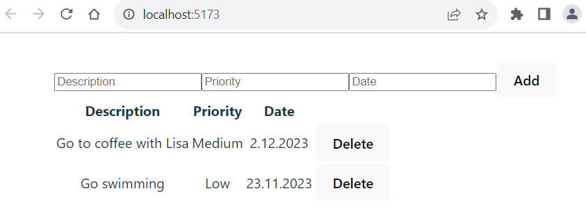
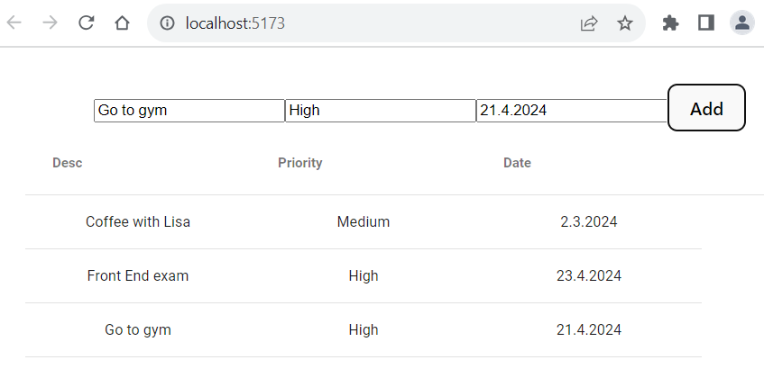
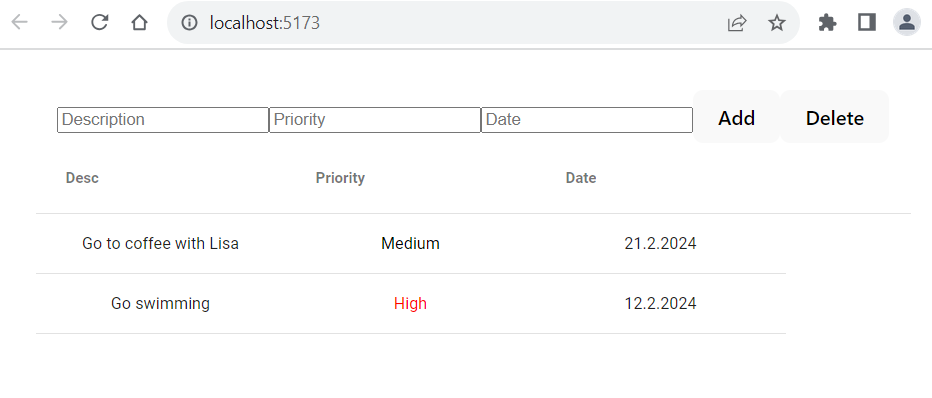

- **AG Grid** (https://www.ag-grid.com/) is popular data grid component that can be used with several JavaScript libraries, such as React.
- AG Grid provides a free community version that is free for everyone, including production use - no license required.
- AG Grid supports TypeScript Generics for row data, cell values and grid context.
- We have developed the Todolist app, and if you have done the assignments, you should now also have date field and delete functionality.
- Let's add a third property to our Todolist that is a priority. Add the `priority` property to the `todo` state and add an input element that user can enter priority which is stored to the state. Update also todo interfce. Then, your Todolist should look like the following screenshot:



- Now, we will replace the HTML table with the AG Grid component in our Todolist app. Then, we can easily get nice features such as sorting, filtering, etc. to our Todolist app.
- Move to your Todolist project folder using the command line.
#### Install AG Grid
- First, you have to install the AG Grid component in your project. The installation command can be found in the component's documentation. In this case in https://www.ag-grid.com/react-data-grid/getting-started/. The npm command is the following and you should execute it in your project folder:
```bash
npm install ag-grid-react
```
- The installed packages are saved to the `package.json` file's `dependencies` section. The `package.json` file can be found in the root directory of project. It contains project information, dependencies and scripts for starting the project.  After the installation, open the `package.json` file and check that AG-Grid component is found.
```json title="package.json"
"dependencies": {
  //highlight-next-line
  "ag-grid-react": "^32.1.0",
  "react": "^18.2.0",
  "react-dom": "^18.2.0"
},
```
:::note
In the line `"ag-grid-react": "^32.1.0"` the `ag-grid-react` is the name of the installed package. The `"^32.1.0"` specifies the installed version. The `^` symbol inidcates that it allows to receive bug fixes and minor version updates. The major version updates are not allowed (For example, 33.0.0). The packages are automatically updated when you execute the `npm install` command. The installed versions are saved to the dependency lock file **package.lock.json** file. If the version is specified `"32.1.0"` it means that the project requires version 32.1.0 and updates are not received automatically. 
:::

### Import AG-Grid component and stylesheets
- To use the AG Grid component in our TodoList component, we have to import it. We import the `AgGridReact` component and stylesheets. AG Grid provides pre-defined themes (https://www.ag-grid.com/react-data-grid/themes/) and we use the Material Design theme. Add the following imports to your `TodoList` component.

```js title="TodoList.tsx"
import { AgGridReact } from "ag-grid-react";

import "ag-grid-community/styles/ag-grid.css";
import "ag-grid-community/styles/ag-theme-material.css"; // Material Design theme
```
### Define columns
- Next, we have to define data grid columns. The columns are defined using a state, and the value is an array of column definition objects. Each column definition object has a mandatory property `field` that defines what data is shown in a column. For example, if we define `{field: 'date'}`, this column shows our `todo` object's `date` property value.

```js title="TodoList.tsx"
const [columnDefs] = useState([
  {field: 'desc'},
  {field: 'priority'},
  {field: 'date'}
]);
```
- We have to define type for the column definitions. AG Grid offers `ColDef` interface that can be used. Import the interface first:

```ts
import { ColDef } from "ag-grid-community";
```

- Then, we can use `ColDef` interface as shown in the code below.

```js title="TodoList.tsx"
const [columnDefs] = useState<ColDef<Todo>[]>([
  {field: 'desc'},
  {field: 'priority'},
  {field: 'date'}
]);
```
- `useState<ColDef<Todo>[]>` is a TypeScript generic that specifies the type of the state. Here, it indicates that `columnDefs` is an array of `ColDef` objects, where each `ColDef` is typed with the `Todo` interface.
- `ColDef<Todo>` ensures that the column definitions are compatible with the `Todo` type, which means the fields specified in the column definitions (desc, priority, date) must exist in the `Todo` interface. The `ColDef` objects specify which fields from the `Todo` interface should be displayed in the grid:

### Display AG-Grid
- Then, we display the `AgGridReact` component. The `rowData` prop defines where row data comes from and the value should be an array. In our case, it is the `todos` array state where our todo objects are stored. The `columnDefs` prop defines the column definition, and it is the `columnDefs` state that we just created before. Remove the `TodoTable` component because now we will use AG Grid to show our data. You have to wrap the `AgGridReact` component inside `div` that defines the theme CSS class and grid size.
```jsx title="TodoList.tsx"
return (
  <>
    <input 
      placeholder="Description" 
      onChange={e => setTodo({...todo, desc: e.target.value })} 
      value={todo.desc} />
    <input 
      placeholder="Priority" 
      onChange={e => setTodo({...todo, priority: e.target.value })} 
      value={todo.priority} /> 
    <input 
      placeholder="Date"
      type="date"
      onChange={e => setTodo({...todo, date: e.target.value })} 
      value={todo.date} />
    <button onClick={addTodo}>Add</button>
      //highlight-start
    <div className="ag-theme-material" style={{width: 700, height: 500}}>
      <AgGridReact 
        rowData={todos}
        columnDefs={columnDefs}
      />
    </div> 
    //highlight-end
  </>
)  
```
Now, your Todolist should look like the following screenshot and the todo table looks already more professional:


### Column properties
- The column properties are used to define the column behavior. So far, we have only used the `field` property in our column definitions.
- You can find all column properties at https://www.ag-grid.com/react-data-grid/column-properties/
- By default, column sort is enabled. Set `sortable` property to `false` to disable sorting on a column.
- You can also get a column-based filter that filters rows using the spcified values. You can enble colmun filter by setting `filter` property to `true`.
- Now, the `columndDef` look like the code below:

```js title="TodoList.tsx"
const [columnDefs] = useState<ColDef<Todo>[]>([
  {field: 'desc', sortable: false, filter: true},
  {field: 'priority', filter: true},
  {field: 'date', filter: true}
]);
```
- Now, column headers also contain a 'hamburger'-menu that opens the column filter. The description column is not anymore sortable.

### Styling cells
- We can use `cellStyle` column property to define cell styling. The value of the property is a callback function that returns an object of css values.
- In the example code below, the priority cell text color is red if the priority value is High.

```js title="TodoList.tsx"
const [columnDefs] = useState<ColDef<Todo>[]>([
  { field: "desc", sortable: true, filter: true },
  { field: "priority", sortable: true, filter: true, 
    //highlight-next-line
    cellStyle: params => params.value === "High" ? {color: 'red'} : {color: 'black'} },
  { field: "date", sortable: true, filter: true }
]);
```
### Delete functionality
- Let’s implement the delete functionality, where the user can select a row, and when the delete button is pressed, the selected row is deleted.
- First, we have to enable row selection and set mode to single selection by using the `rowSelection` grid prop.
```jsx title="TodoList.jsx"
<AgGridReact
  columnDefs={columns}
  rowData={todos}>
  //highlight-next-line
  rowSelection="single" 
/>
```
- We should be able to get the selected row, and therefore we need access to the ag-grid component’s API. The API provides a method called `getSelectedNodes()` that we can use to get the selected row index.
- To get access to the Grid API, we can use the React `useRef` hook function (https://react.dev/reference/react/useRef). The React `ref` can be used to get direct access to a DOM element. We can use utilizd type `AgGridReact<Todo>` with the `useRef` hook (https://www.ag-grid.com/react-data-grid/typescript-generics/).

```js title="TodoList.tsx"
// Import useRef
import { useRef, useState } from 'react'

function TodoList() {
  const [todo, setTodo] = useState({ desc: '', date: '', priority: '' });
  const [todos, setTodos] = useState([]);
  //highlight-next-line
  const gridRef = useRef<AgGridReact<Todo>>(null);
```
- By using `ref` prop we can make a reference to the `AgGridReact` component. It allows us to access it's methods directly.
```jsx title="TodoList.tsx"
<AgGridReact 
  //highlight-next-line
  ref={gridRef}
  rowData={todos}
  columnDefs={columnDefs}
  rowSelection="single"
/>
```
- The `AgGridReact` component's methods are in the Grid API (https://www.ag-grid.com/react-data-grid/grid-api/). We can now access the api using the `gridRef.current?.api`. The `?` operator is known as the **optional chaining** operator. It allows you to safely access deeply nested properties without having to explicitly check if each reference in the chain is non-null or undefined. In some situations, you need to use AG Grid's `onGridReady` to verify that the grid has initialized and is ready for most API calls, but it may not be fully rendered yet.

Next, we add Delete button inside the `return` statement and when the button is pressed, it call `handleDelete` function.
```jsx
return (
    <>
      <input 
        placeholder="Description" 
        onChange={e => setTodo({...todo, desc: e.target.value })} 
        value={todo.desc} />
      <input 
        placeholder="Priority" 
        onChange={e => setTodo({...todo, priority: e.target.value })} 
        value={todo.priority} /> 
      <input 
        placeholder="Date" 
        onChange={e => setTodo({...todo, date: e.target.value })} 
        value={todo.date} />
      <button onClick={addTodo}>Add</button>
      //highlight-next-line
      <button onClick={handleDelete}>Delete</button>
      <div className="ag-theme-material" style={{width: 700, height: 500}}>
        <AgGridReact 
          ref={gridRef}
          rowData={todos}
          columnDefs={columnDefs}
          rowSelection="single"
        />
      </div>    
    </>
)
```
- Finally, we implement the `handleDelete` function. We can use the grid API's `getSelectedNodes` method, which returns an array of selected rows. We are using the single selection mode; therefore, it only returns one row. The row index can be get from the row object's `id` property. We use the JavaScript `filter` function to filter selected row from the `todos` state. The `filter` function creates a new array containing elements from the original array that meet a specific condition. It does not modify the original array but returns a new array with the filtered elements.
```js title="TodoList.tsx"
const handleDelete = () => {
  setTodos(todos.filter((todo, index) => 
      index != gridRef.current?.api.getSelectedNodes()[0].id))
};
```
- If you select a row in the grid and press the Delete button, the selected row is deleted from the grid. If you don't select any row and press the Delete button, you can see an error in the console. We also have to check that one row is selected before filtering.
```js title="TodoList.tsx"
const handleDelete = () => {
  if (gridRef.current?.api.getSelectedNodes().length > 0) {
    setTodos(todos.filter((todo, index) => 
      index != gridRef.current?.api.getSelectedNodes()[0].id))
  }
  else {
    alert('Select a row first!');
  }
};
```
- Now, we have finalized our Todolist using the AG Grid, and your Todolist should look like the following screenshot:



Next, we are going to style the rest of our Todolist app using the Material Design styling.