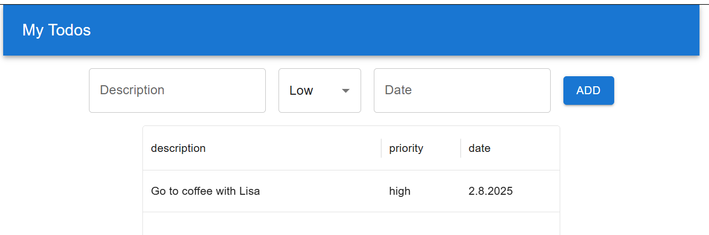
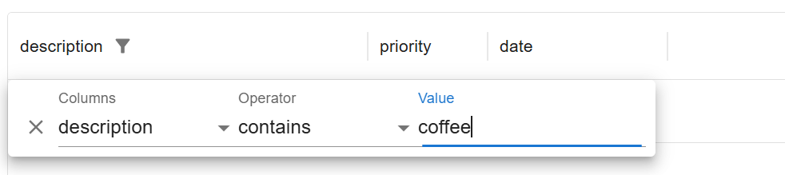
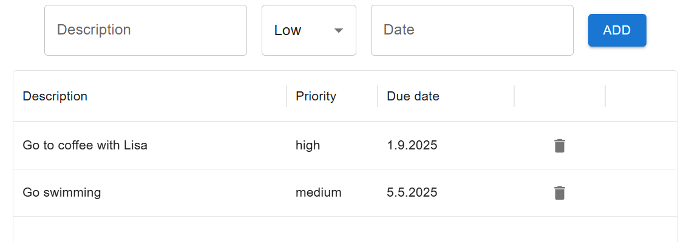

MUI has a product called **MUI X** (https://mui.com/x/) that provides advaced components such as data grid, charts and date picker. 
Now, we will replace the HTML table with the `DataGrid` in our Todolist app. Then, we can easily add useful features such as sorting, filtering, etc. to our todo list app.

#### Install DataGrid

To start use MUI X `DataGrid` component, you have to install it using the following npm command:
```bash
npm install @mui/x-data-grid
```

### Unique id
Material UI's `DataGrid` component requires each row to have a unique identifier. By default, the `DataGrid` looks for a property named `id` in the data set to get that identifier. Our current todo items lack this unique identifier. If the row's identifier is not called `id`, then you need to use the `getRowId` prop to tell the `DataGrid` what field to uses.

Typically, data fetched from a REST API includes unique identifiers. In our case, we don't have a unique identifier in todo items. Let's update our app to include unique ids for our todo items using the `uuid` library (https://github.com/uuidjs/uuid), which can be used to generate unique ids.

Install the uuid library:
```bash
npm install uuid
```
The following example show how to genrate an id using the uuid library:
```ts
import { v4 as uuidv4 } from 'uuid';
uuidv4(); // '9b1def4d-2b7d-1bad-9bdd-2b0dwa3dcb6f'
```
Open the `types.ts` file and add `ìd` property to the `Todo` type:
```ts
export type Todo = {
  //highlight-next-line
  id: string;
  description: string;
  priority: 'low' | 'medium' | 'high';
  date: string;
}
```
Import `uuid` to the `TodoList` component and generate unique id when new todo is added:
```tsx title="TodoList.tsx"
import { useState } from 'react';
import type { Todo } from './types';
import TodoTable from './TodoTable';
import Button from '@mui/material/Button';
import TextField from '@mui/material/TextField';
import Stack from "@mui/material/Stack";
//highlight-next-line
import { v4 as uuidv4 } from 'uuid';

function TodoList() {
  const [todo, setTodo] = useState<Todo>({id: '', description: '', priority: 'low', date: ''});
  const [todos, setTodos] = useState<Todo[]>([]);
  
  const addTodo = () => {
    if (!todo.description || !todo.date) {
      alert("Enter values first!");
    } 
    else {
      //highlight-next-line
      setTodos([...todos, { ...todo, id: uuidv4()}]);
      setTodo({id: '', description: '', priority: 'low', date: '',});
    }
  };

  // continue...
```
Now, when you add a new todo, it contains a unique id field.

### Import DataGrid component and define columns

Import `Datagrid` to your `TodoTable` component:
```tsx title="TodoTable.tsx"
import { DataGrid } from '@mui/x-data-grid';
```
Columns are defined using objects and the type of objects is `GridColDef`, that is interface provided by `DataGrid` (https://mui.com/x/api/data-grid/). The required `field` property is used to define where the field get its value. For example, the column with field `description` will display the value stored in `todo.description`.

```ts
// Import GirdColDef
import { DataGrid, GridColDef } from '@mui/x-data-grid';

// Define columns
const columns: GridColDef[] = [
  { field: 'description' },
  { field: 'priority' },
  { field: 'date' },
]
```
### Display DataGrid

Then, we display the `DataGrid` component. The `rows` prop defines where row data comes from and the value should be an array. In our case, it is the `todos` array state that is passed to the `TodoTable` component using `props`. The `columns` prop defines the column definition, and it is the `columns` that we just created before. You have to wrap the `DataGrid` component inside `div` that defines the grid size. You can also use flex container with `flex-direction: 'column'`.
```tsx title="TodoTable.tsx"
return(
  <div style={{ height: 500, width: '60%', margin: 'auto' }}>
    <DataGrid rows={props.todos} columns={columns} />
  </div>
)
```
### Column properties

The column properties are used to define the column behavior. So far, we have only used the `field` property in our column definitions. You can find all column properties at https://mui.com/x/react-data-grid/column-definition/. By default, column sort is enabled. Set `sortable` property to `false` to disable sorting on a column.

If you type a todo with a long description, you can see that it doesn't fit to the column. The default width of column is 100px and you can change it using the `width` property:
```ts
// Set column width
const columns: GridColDef[] = [
  { field: 'description', width: 300 },
  { field: 'priority' },
  { field: 'date', width: 150 },
]
```
Now, the todo list app look the following:



Each column headers also contain a menu that opens the column filter and other functionalities. 



The column header text can be defined using the `headerName` property. By default, the header title is derived from the `field` property:
```ts
// Set column width
const columns: GridColDef[] = [
  { field: 'description', headerName: 'Description', width: 300 },
  { field: 'priority', headerName: 'Priority', },
  { field: 'date', headerName: 'Due date', width: 150 },
]
```
Next, we will implement delete funtionality.

### Delete functionality
In this phase, we will use Material Icons. If you haven't installed them yet, you can do so by following the instructions here: http://mui.com/material-ui/getting-started/installation/#icons

Previously, we implemented the delete functionality by using the row index. Now, we have a unique `id` property that we can use to delete todo items. The type of the `id` is `string`, so we have to do some changes to our types and `deleteTodo` function.

Update the `handleDelete` function to accept an `id` parameter of type `string`.
```ts title="types.ts"
export type TodoTableProps = {
  todos: Todo[];
  handleDelete: (id: string) => void;
}
```
Update the `deleteTodo` function to accept an `id` parameter of type `string` and use the `todo.id` property in the `filter` method.
```ts title="TodoList.tsx"
const deleteTodo = (id: string) => {
  setTodos(todos.filter(todo => id !== todo.id));
};
```
By default, columns are assumend to show strings in `DataGrid`. You can define column type to be `action`. The `action` column type is used to define a column that contains action buttons or icons.

```ts title="TodoTable.tsx"
const columns: GridColDef[] = [
  { field: 'description', headerName: 'Description', width: 300 },
  { field: 'priority', headerName: 'Priority', },
  { field: 'date', headerName: 'Due date', width: 150 },
  {
    field: 'actions',
    type: 'actions',
    // action buttons
  },
]
```
If the column type is `actions`, you need to provide a `getActions` function that returns an array of actions available for each row (`React.ReactElement<GridActionsCellItemProps>[]`).  The type of the `params` that is passed to `getActions` funcion is `GridRowParams`. Import `GridRowParams` from `@mui/x-data-grid`. 
```ts title="TodoTable.tsx"
const columns: GridColDef[] = [
  { field: 'description', headerName: 'Description', width: 300 },
  { field: 'priority', headerName: 'Priority', },
  { field: 'date', headerName: 'Due date', width: 150 },
  {
    field: 'actions',
    type: 'actions',
    //highlight-start
    getActions: (params: GridRowParams) => [
      // actions
    ]
    //highlight-end
  },
]
```
The `params` that is passed to `getActions` function contains `row` property that is the row model of the row that the current cell belongs to. You can use that to access row values (https://mui.com/x/api/data-grid/grid-row-params/).

Next, we will implement the actions. Import the delete icon from `mui/x-data-grid`.
```ts
import DeleteIcon from '@mui/icons-material/Delete';
```
You can explore the icons available in the Material Icons library here: https://mui.com/material-ui/material-icons/.

Next, import and display `GridActionsCellItem` to implement actions. The `icon` prop specifies the icon to display, and the `onClick` event handler defines the function to execute when the action is clicked. In our case, we call `handleDelete` function and pass todo `id` as an argument.
```ts title="TodoTable.tsx"
const columns: GridColDef[] = [
  { field: 'description', headerName: 'Description', width: 300 },
  { field: 'priority', headerName: 'Priority', },
  { field: 'date', headerName: 'Due date', width: 150 },
  {
    field: 'actions',
    type: 'actions',
    getActions: (params: GridRowParams) => [
      //highlight-start
      <GridActionsCellItem 
        icon={<DeleteIcon />} 
        onClick={() => props.handleDelete(params.row.id)} 
        label="Delete" />,
        //highlight-end
    ]
  },
]
```
Now, you can see delete icon in each row and when you click it, the row is deleted:



You can read more about `DataGrid` column types in https://mui.com/x/react-data-grid/column-definition/#column-types.

---
### Further reading
- https://mui.com/x/react-data-grid/
