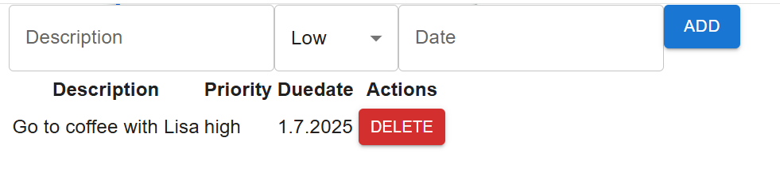
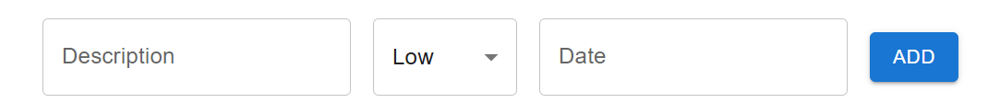
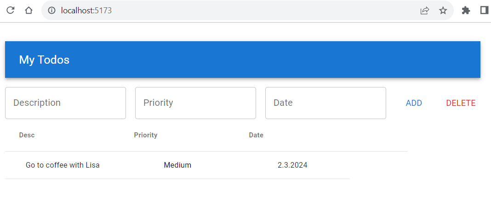

### Installation

- MUI (https://mui.com/) provides component libraries and tools for React. We are going to use Material UI that is a library of React UI components that implements Google's Material Design (https://mui.com/material-ui/getting-started/). 
- To start using Material UI, you have to install it to your project using the following npm command (use your Todolist project with AG-Grid):
```bash
npm install @mui/material @emotion/react @emotion/styled
```
If you want to use icons, you should install the following library:
```bash
npm install @mui/icons-material
```

### Container
- First, we will use the `Container` component, which is basic layout component, and it centers your app content horizontally. The maxWidth props defines the maximum width of our app, and we are using the largest value. We will also use the `CssBaseline` component that is used to fix inconsistencies across different browsers. Open the **App.jsx** file and do the following modifications:

```jsx {2-3,8-9,11} title="App.jsx"
import "./App.css";
import Container from '@mui/material/Container';
import CssBaseline from '@mui/material/CssBaseline';
import TodoList from "./TodoList";

function App() {
  return (
    <Container maxWidth="xl">
      <CssBaseline />
      <TodoList />
    </Container>
  );
}

export default App;
```
- MUI uses Google Roboto fonts and you can read the installation instructions in https://mui.com/material-ui/getting-started/installation/#roboto-font
- Now, we are ready to use other UI components.

### Button
- Instead of using HTML button element, we can now use Material UI `Button` component (https://mui.com/material-ui/react-button/).
- Open the **TodoList.jsx** file and add the following import:
```js title="TodoList.jsx"
import Button from '@mui/material/Button';
```
- Then, we change the HTML button elements to the `Button` component:
```jsx {15-16} title="TodoList.jsx"
 return (
  <>
    <input 
      placeholder="Description" 
      onChange={e => setTodo({...todo, desc: e.target.value })} 
      value={todo.desc} />
    <input 
      placeholder="Priority" 
      onChange={e => setTodo({...todo, priority: e.target.value })} 
      value={todo.priority} /> 
    <input 
      placeholder="Date" 
      onChange={e => setTodo({...todo, date: e.target.value })} 
      value={todo.date} />
    <Button onClick={addTodo}>Add</Button>
    <Button onClick={handleDelete}>Delete</Button>
    <div className="ag-theme-material" style={{width: 700, height: 500}}>
      <AgGridReact 
        ref={gridRef}
        onGridReady={ params => gridRef.current = params.api }
        rowData={todos}
        columnDefs={columnDefs}
        rowSelection="single"
      />
    </div>    
  </>
)
```
- Material Design has three different button variants (styles): Text, Outlined, and Contained. The default variant used in Material UI is Text. You can use `variant` prop to change the value.
```js
// Change button variant
<Button variant="contained" onClick={addTodo}>Add</Button>
```
- You can change the button color by using the `color` prop. You can find the examples in https://mui.com/material-ui/react-button/#color and change your Delete button color to red.
- The `Button` component props are listed in https://mui.com/material-ui/api/button/.

### TextField
- The Material UI provides `TextField` component (https://mui.com/material-ui/react-text-field/) that let user enter and edit text. We will use that in our Todolist app instead of HTML input elements.
- To start use the `TextField` component, import it in the `TodoList` component.
```js title="TodoList.jsx"
import TextField from '@mui/material/TextField';
``` 
- The `label` prop is used to set label for `TextField` components.
- The
```jsx {3-14} title="TodoList.jsx
return (
  <>
    <TextField 
      label="Description" 
      onChange={e => setTodo({...todo, desc: e.target.value })} 
      value={todo.desc} />
    <TextField
      label="Priority" 
      onChange={e => setTodo({...todo, priority: e.target.value })} 
      value={todo.priority} /> 
    <TextField
      label="Date" 
      onChange={e => setTodo({...todo, date: e.target.value })} 
      value={todo.date} />
    <Button onClick={addTodo}>Add</Button>
    <Button color="error" onClick={handleDelete}>Delete</Button>
    <div className="ag-theme-material" style={{width: 700, height: 500}}>
      <AgGridReact 
        ref={gridRef}
        onGridReady={ params => gridRef.current = params.api }
        rowData={todos}
        columnDefs={columnDefs}
        rowSelection="single"
      />
    </div>    
  </>
)
```
- Material Design has three different text field variants (styles): Standard, Outlined, and Filled. The default variant used in Material UI is Outlined. You can use `variant` prop to change the value.
- The `TextField` component props are listed in https://mui.com/material-ui/api/text-field/.
- Now, your UI should look like the following:



- It doesn't look good yet. To get some spacing between components and align these properly, we can use the layout component called `Stack`.
- `Stack` is one dimensional layout component that we can use to set spaces between text fields and set alignments. To get started, add the following import to the TodoList.jsx file.
```js title="TodoList.jsx"
import Stack from '@mui/material/Stack';
```
- Next, we wrap the `Button` and `textField` components with the `Stack` component. The `Stack` component layout is using Flex and the default direction is column. We set direction to row using the component's `direction` prop. The `spacing` prop is used to set spacing between items inside the `Stack` component. You can read more about spacing and units in https://mui.com/material-ui/customization/spacing/.
```jsx title="TodoList.jsx"
return (
  <>
    //highlight-next-line
    <Stack direction="row" spacing={2}>
      <TextField 
        label="Description" 
        onChange={e => setTodo({...todo, desc: e.target.value })} 
        value={todo.desc} />
      <TextField
        label="Priority" 
        onChange={e => setTodo({...todo, priority: e.target.value })} 
        value={todo.priority} /> 
      <TextField
        label="Date" 
        onChange={e => setTodo({...todo, date: e.target.value })} 
        value={todo.date} />
      <Button onClick={addTodo}>Add</Button>
      <Button color="error" onClick={handleDelete}>Delete</Button>
    //highlight-next-line
    </Stack>
    <div className="ag-theme-material" style={{width: 700, height: 500}}>
      <AgGridReact 
        ref={gridRef}
        onGridReady={ params => gridRef.current = params.api }
        rowData={todos}
        columnDefs={columnDefs}
        rowSelection="single"
      />
    </div>    
  </>
)
```
- Finally, we set alignment using the `justifyContent` and `alignItems` props to center components horizontally and vertically.
```jsx
<Stack 
  direction="row" 
  spacing={2} 
  justifyContent="center" 
  alignItems="center"
>    
```
- Now, your Todolist UI should look the following:



- Material Design app bar displays information and actions relating to the current screen. We can implement the app bar by using the Material UI `AppBar` component (https://mui.com/material-ui/react-app-bar/).
- We will implement app bar in the `App` component. Add the following imports to your App.jsx file.
```js title="App.jsx"
import AppBar from '@mui/material/AppBar';
import Toolbar from '@mui/material/Toolbar';
import Typography from '@mui/material/Typography';
```
- Then, render the components in the `App` component. The `AppBar` component's `position` defines the positioning fo the app bar. When you set `position="static"`, the AppBar remains at the top of the screen and does not scroll with the content. You can see the possible values in https://mui.com/material-ui/api/app-bar/#AppBar-prop-position. The `Typography` component provides predefined text sizes, and we will use this in our toolbar text. variant props can be used to define text size:

```jsx {5-11} title="App.jsx"
function App() {
  return (
    <Container maxWidth="xl">
      <CssBaseline />
      <AppBar position="static">
        <Toolbar>
          <Typography variant="h6">
            My Todos
          </Typography>  
        </Toolbar>
      </AppBar>
      <TodoList />
    </Container>
  );
}
```
- Now, if you look the Todolist UI, it already looks nice but now you need some spacing between the app bar and text fields. You can use the `mt` prop of the `Stack` component to get top margin to your text fields and buttons. The Material UI provides custom props that you can use to change CSS properties https://mui.com/system/properties/#properties-reference-table
```jsx title="TodoList.jsx"
<Stack 
  mt={2} 
  direction="row" 
  spacing={2} 
  justifyContent="center" 
  alignItems="center"
>
```
- Finally, your Todolist should look like the following screenshot:

- Now, we are ready with our Todolist app but you can try to use more different Material UI components in your UI. You can, for example, use icon buttons (https://mui.com/system/properties/#properties-reference-table). You can also use drop down in priority, so that only pre-defined priority values can be selected (https://mui.com/material-ui/react-select/).
