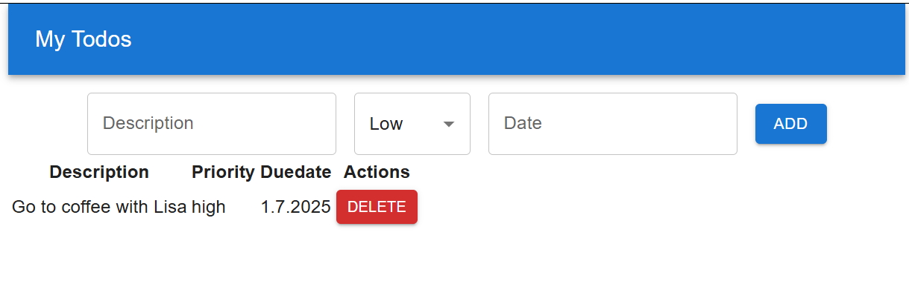

### Installation
MUI (https://mui.com/) provides component libraries and tools for React. We are going to use **Material UI** that is a library of React UI components that implements Google's Material Design (https://mui.com/material-ui/getting-started/).

To start using Material UI, you have to install it to your project using the following npm command. In this chapter, we use Todolist app with description, date and priority fields that we implemented earlier in React Project section: 
```bash
npm install @mui/material @emotion/react @emotion/styled
```
The installed packages are saved to the `package.json` file's `dependencies` section. The `package.json` file can be found in the root directory of project. It contains project information, dependencies and scripts for starting the project. After the installation, open the `package.json` file and check that Material UI components are found from the `dependencies` node.

```json title="package.json"
"dependencies": {
  "@emotion/react": "^11.14.0",
  "@emotion/styled": "^11.14.0",
  "@mui/material": "^6.4.7",
  "react": "^19.0.0",
  "react-dom": "^19.0.0"
},
```
:::note
In the line `"@mui/material": "^6.4.7"` the `@mui/material` is the name of the installed package. The `"^6.4.7"` specifies the installed version. The `^` symbol inidcates that it allows to receive bug fixes and minor version updates. The major version updates are not allowed (For example, 7.0.0). The packages are automatically updated when you execute the `npm install` command. The installed versions are saved to the dependency lock file **package.lock.json** file. If the version is specified `"6.4.7"` it means that the project requires version 6.4.7 and updates are not received automatically.
:::

If you want to use icons, you should install the following library:
```bash
npm install @mui/icons-material
```
Material UI uses Google Roboto fonts and you can read the installation instructions in https://mui.com/material-ui/getting-started/installation/#roboto-font.

We won't use Vite's default styling anymore. Remove the `css`-file imports from the `App.tsx` and `main.tsx` files.

### Container
First, we will use the `Container` component, which is basic layout component, and it centers your app content horizontally. The maxWidth props defines the maximum width of our app, and we are using the largest value. We will also use the `CssBaseline` component that is used to fix inconsistencies across different browsers. Open the **App.tsx** file and do the following modifications:

```jsx {2-3,8-9,11} title="App.tsx"
import Container from '@mui/material/Container'
import CssBaseline from '@mui/material/CssBaseline'
import TodoList from ''./TodoList'

function App() {
  return (
    <Container maxWidth="xl">
      <CssBaseline />
      <TodoList />
    </Container>
  )
}

export default App
```
Now, we are ready to use other UI components.

### Button
Instead of using HTML button element, we can now use Material UI `Button` component (https://mui.com/material-ui/react-button/).

Open the `TodoList.tsx` and `TodoTable.tsx` files and add the following import to both files:
```js title="TodoList.tsx & TodoTable.tsx"
import Button from '@mui/material/Button'
```
Then, we change the HTML button elements to the `Button` component:
```jsx title="TodoList.tsx"
  return(
    <>
      <input 
        placeholder="Description" 
        onChange={event => setTodo({...todo, description: event.target.value})} 
        value={todo.description} 
      />
      <select
        title="Priority"
        onChange={event => setTodo({...todo, priority: event.target.value as 'low' | 'medium' | 'high'})} 
        value={todo.priority} 
      >
        <option value="low">Low</option>
        <option value="medium">Medium</option>
        <option value="high">High</option>
      </select>
      <input 
        placeholder="Date"
        type="date"
        onChange={event => setTodo({...todo, date: event.target.value})} 
        value={todo.date} 
      />
      //highlight-next-line
      <Button onClick={addTodo}>Add</Button> 
      <TodoTable todos={todos} handleDelete={deleteTodo} />
    </>
  );
```

```jsx title="TodoTable.tsx"
  return(
    <table>
      <thead>
        <tr>
          <th>Description</th>
          <th>Priority</th>
          <th>Duedate</th>
          <th>Actions</th>
        </tr>
      </thead>
      <tbody>
        {props.todos.map((todo, index) => (
          <tr key={index}>
            <td>{todo.description}</td>
            <td>{todo.priority}</td>
            <td>{todo.date}</td>
            <td>
              //highlight-start
              <Button onClick={() => props.handleDelete(index)}>
                Delete
              </Button>
              //highlight-end 
            </td>
          </tr>
        ))}
      </tbody>
    </table>     
  )
```
Material UI has three different button variants (styles): Text, Outlined, and Contained. The default variant used in Material UI is Text. You can use `variant` prop to change the style.
```js
// Change button variant
<Button variant="contained" onClick={addTodo}>
  Add
</Button>
```
You can change the button color by using the `color` prop. You can find the examples in https://mui.com/material-ui/react-button/#color and change your Delete button color to red.
```tsx
<Button 
  variant="contained"
  size="small"
  color="error"
  onClick={() => props.handleDelete(index)}
>
  Delete
</Button> 

```

The `Button` component props are listed in https://mui.com/material-ui/api/button/.

### TextField
The Material UI provides `TextField` component (https://mui.com/material-ui/react-text-field/) that let user enter and edit text. We will use that in our Todolist app instead of HTML input elements.

To start use the `TextField` component, import it in the `TodoList` component.
```js title="TodoList.tsx"
import TextField from '@mui/material/TextField'
```
The `label` prop is used to set label for `TextField` components.
```jsx title="TodoList.tsx
 return(
    <>
      //highlight-start
      <TextField 
        label="Description" 
        onChange={event => setTodo({...todo, description: event.target.value})} 
        value={todo.description} 
      />
      //highlight-end
      <select
        helperText="Select priority"
        onChange={event => setTodo({...todo, priority: event.target.value as 'low' | 'medium' | 'high'})} 
        value={todo.priority} 
      >
        <option value="low">Low</option>
        <option value="medium">Medium</option>
        <option value="high">High</option>
      </select>
      //highlight-start
      <TextField 
        label="Date"
        onChange={event => setTodo({...todo, date: event.target.value})} 
        value={todo.date} 
      />
      //highlight-end
      <Button variant="contained" onClick={addTodo}>
        Add
      </Button> 
      <TodoTable todos={todos} handleDelete={deleteTodo} /> 
    </>
  );
```
Material UI has three different text field variants (styles): Standard, Outlined, and Filled. The default variant used in Material UI is Outlined. You can use `variant` prop to change the style.

The `TextField` component props are listed in https://mui.com/material-ui/api/text-field/.

### Select

Next, we will replace the `select` element with a Material UI  `Select` component. 
```tsx title="TodoList.tsx"
<Select
  sx={{ minWidth: 100 }}
  autoWidth={false}
  label="Priority"
  defaultValue="low"
  onChange={event => setTodo({...todo, priority: event.target.value as 'low' | 'medium' | 'high'})} 
  value={todo.priority} 
>
  <MenuItem key="low" value="low">Low</MenuItem>
  <MenuItem key="medium" value="medium">Medium</MenuItem>
  <MenuItem key="high" value="high">High</MenuItem>
</Select>
```
Now, your UI should look like the following:


It doesn't look good enough yet. To get some spacing between components and align these properly, we can use the layout component called `Stack`.

`Stack` is one dimensional layout component that we can use to set spaces between text fields and set alignments. To get started, add the following import to the `TodoList.tsx` file.
```js title="TodoList.tsx"
import Stack from '@mui/material/Stack'
```
Next, we wrap the `Button` and `textField` components with the `Stack` component. The `Stack` component layout is using Flex and the default direction is column. We set direction to row using the component's `direction` prop. The `spacing` prop is used to set spacing between items inside the `Stack` component. You can read more about spacing and units in https://mui.com/material-ui/customization/spacing/.

```jsx title="TodoList.tsx"
return(
    <>
      //highlight-next-line
      <Stack direction="row" mt={2} spacing={2}>
        <TextField 
          label="Description" 
          onChange={event => setTodo({...todo, description: event.target.value})} 
          value={todo.description} 
        />
        <Select
          sx={{ minWidth: 100 }}
          autoWidth={false}
          label="Priority"
          defaultValue="low"
          onChange={event => setTodo({...todo, priority: event.target.value as 'low' | 'medium' | 'high'})} 
          value={todo.priority} 
        >
          <MenuItem key="low" value="low">Low</MenuItem>
          <MenuItem key="medium" value="medium">Medium</MenuItem>
          <MenuItem key="high" value="high">High</MenuItem>
        </Select>
        <TextField 
          label="Date"
          onChange={event => setTodo({...todo, date: event.target.value})} 
          value={todo.date} 
        />
        <Button variant="contained" onClick={addTodo}>
          Add
        </Button>
      //highlight-next-line
      </Stack>
      <TodoTable todos={todos} handleDelete={deleteTodo} />
    </>
  );
  ```
Finally, we set alignment using the `justifyContent` and `alignItems` props to center components horizontally and vertically.
```tsx
<Stack
  direction="row"
  spacing={2}
  justifyContent="center"
  alignItems="center"
>
```
Now, your Todolist inputs and button should look the following:


#### Validation
Form validation is a important part of front end development. The Material UI `TextField` component includes props that can be used in validation. For instance, if the description field in our Todolist app is mandatory, we can utilize the `required` prop of the `TextField` component. This will mark the field as required by displaying a `*`.

```tsx
<TextField 
  label="Description" 
  onChange={event => setTodo({...todo, description: event.target.value})} 
  value={todo.description}
  required
/>
```
Now, the description text field looks the follwing:


Then, we can use `error` prop to indicate if validation error occurs. If the `error` prop value is `true`, the label and border is displayed in red color. Create a state to control if description value is provided.
```ts
const [descriptionError, setDescriptionError] = useState(false);
```
In the `addTodo` function, you can verify the `description` value and update the state to `true` if the value is either `undefined` or `null`, otherwise we set state to `false`:
```ts
  const addTodo = () => {
    if (!todo.description) {
      //highlight-next-line
      setDescriptionError(true);
    } 
    else {
      //highlight-next-line
      setDescriptionError(false);
      setTodos([...todos, { ...todo, id: uuidv4()}]);
      setTodo({id: '', description: '', priority: 'low', date: '',});
    }
  };
```
The `error` prop is linked to the `descriptionError` state:
```tsx
<TextField 
  label="Description" 
  onChange={event => setTodo({...todo, description: event.target.value})} 
  value={todo.description}
  required
  //highlight-next-line
  error={descriptionError}
/>
```
If you add a new todo without filling in the description field, it will be highlighted in red: 


The `helperText` prop can be used to provide feedback to the user about the error.

:::note
There are also third-party form libraries available that can be used for more advanced form handling:
- Formik: https://formik.org/
- React Hook Form: https://react-hook-form.com/
:::

### App Bar
Material UI app bar displays information and actions relating to the current screen. We can implement the app bar by using the Material UI `AppBar` component (https://mui.com/material-ui/react-app-bar/).

We will implement app bar in the `App` component. Add the following imports to your App.tsx file.

```js title="App.tsx"
import AppBar from '@mui/material/AppBar'
import Toolbar from '@mui/material/Toolbar'
import Typography from '@mui/material/Typography'
```

Then, render the components in the `App` component. The `AppBar` component's `position` defines the positioning fo the app bar. When you set `position="static"`, the AppBar remains at the top of the screen and does not scroll with the content. You can see the possible values in https://mui.com/material-ui/api/app-bar/#AppBar-prop-position. The `Typography` component provides predefined text sizes, and we will use this in our toolbar text. variant props can be used to define text size:

```jsx {5-9} title="App.tsx"
function App() {
  return (
    <Container maxWidth="xl">
      <CssBaseline />
      <AppBar position="static">
        <Toolbar>
          <Typography variant="h6">My Todos</Typography>
        </Toolbar>
      </AppBar>
      <TodoList />
    </Container>
  )
}
```
Now, if you look the Todolist UI, it already looks nice but now you need some spacing between the app bar and text fields. You can use the `mt` prop of the `Stack` component to get top margin to your text fields and buttons. The Material UI provides custom props that you can use to change CSS properties https://mui.com/system/properties/#properties-reference-table

```jsx title="TodoList.jsx"
<Stack mt={2} direction="row" spacing={2} justifyContent="center" alignItems="center">
```
Finally, your Todolist should look like the following screenshot:



Next, we will enhance the styling of our table by using the MUI `DataGrid` component.

---
### Further reading
- https://mui.com/material-ui/