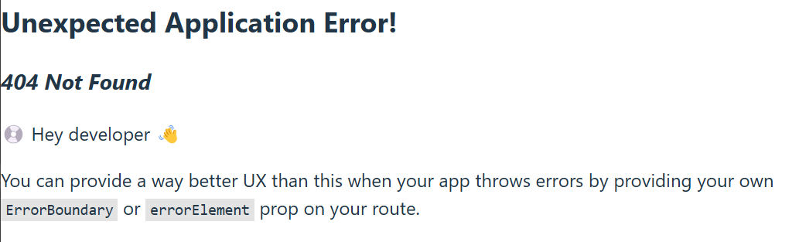

React Router (https://reactrouter.com) is a collection of navigational components for React or React Native applications. There are three different modes to use React Router (Declarative, Data and Framework). In this material, we are using Data mode.

Install React Router using the following npm command:
```bash
npm install react-router
```
### React Router example application
In the following example, we create routing for an app with three components ``Home``, ``About`` and ``Contact``. The routing is created in the application root in `main.tsx`


First, you need to create the components that the routing will contain:
```tsx
// Home.tsx 
export default function Home() {
  return(<h3>Welcome to my app</h3>);
}

// About.tsx
export default function About() {
  return(<h3>Discover the features of our application</h3>);
}

// Contact.tsx
export default function Contact() {
  return(<h3>Email: myapp@contact.com</h3>);
}
```
`App` component contains the application navigation.  The `Link` component in React Router allows users to navigate to different pages within the app. It renders an `<a>` HTML element, with its `href` attribute set to the value specified in the `to` prop, directing the user to the desired resource. Alternatively, you can use React Router's `NavLink` component (https://reactrouter.com/en/main/components/nav-link), which provides additional functionality by indicating when a link is active.

`Outlet` component renders the page navigated to within the `App` view. It acts as a placeholder where the nested routes will be displayed when their path matches the current URL. 
```tsx title="App.tsx"
import { Link, Outlet } from 'react-router';

function App() {
  return (
    <>
      <nav>
        <Link to={"/"}>Home</Link>
        <Link to={"/about"}>About</Link>
        <Link to={"/contact"}>Contact</Link>
      </nav>
      <Outlet />
    </>
  );
}

export default App;
```
First, we will create ***BrowserRouter*** in the root of the application (`main.tsx`) using the `createBrowserRouter` function. It takes an array of route objects as an argument and it creates a router instance that listens to URL changes and allows your app to manage navigation. It also keeps track of the browsing history.

```ts title="main.tsx"
import App from './App';
import { createBrowserRouter } from 'react-router';

const router = createBrowserRouter([
  {
    path: "/",
    element: <App />,
  },
]);
```
In the example code, we create the **root route** that renders our `App` component when user navigates to the `/`- endpoint.

```ts title="main.tsx"
const router = createBrowserRouter([
  // root route
  {
    path: "/",
    element: <App />,
  },
]);
```
The `path` property is a path pattern. When it matches to current URL, the element will be rendered If a route path pattern ends with `/*` it will match any characters following the `/`.

Next, we will create rest of our routes. They are created as children of the root route. One of the children is defined as the index route. It is rendered at the root path `/`.

```ts title="main.tsx"
const router = createBrowserRouter([  // Import components that are used in routes
  {
    path: "/",
    element: <App />,
    children: [                       // children are nested routes with a route
      {
        element: <Home />,
        index: true                   // index route does not need any path
      },
      {
        path: "about",                // path can be defined relative to the parent path
        element: <About />,
      },
      {
        path: "contact",
        element: <Contact />,
      },
    ]
  }
]);
```
Finally, we will use `RouterProvider` component to render the router and pass our routes to this component using the `router` prop. It acts as the root component that connects the router logic to your React app, enabling it to handle navigation, URL changes, and rendering of the defined components for each route.

```tsx title="main.tsx"
import { createBrowserRouter, RouterProvider } from 'react-router';
...

const router = createBrowserRouter([
  {
    path: "/",
    element: <App />,
...

ReactDOM.createRoot(document.getElementById('root')).render(
  <React.StrictMode>
    <RouterProvider router={router} />
  </React.StrictMode>,
);
```


### Error handling
Navigation to a path that does not exist causes an error, and the React Router default error component is rendered:



We can create an own component that will be rendered when error happens. The `errorElement` prop can be used to define an element that is rendered if router throws an exception. If the `errorElement` is defined for the root route, it applies everywhere in the router.

```ts
const router = createBrowserRouter([
  {
    path: "/",
    element: <App />,
    errorElement: <Error />
  },
  // continue...
```
Hook `useRouteError` can be used in an `errorElement` and it returns the error that was thrown.
```ts
// Error.tsx
import { useRouteError } from 'react-router';

export default function Error() {
  const error = useRouteError();
  console.log(error);   // check the console to see the full contents of the error object

  return (
    <>
      <h1>Page not found</h1>
      <p>{error.data}</p>
    </>
  );
}
```
---
### Further reading
- React Router library: https://reactrouter.com/
 