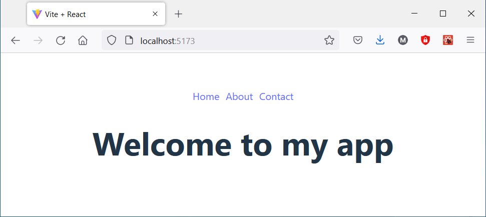

- React Router (https://reactrouter.com) is a collection of navigational components for React or React Native applications.
- Installation command for the React web apps:
```bash
npm install react-router-dom
```
---
### React Router example application
- In the following example, we create routing for an app with three components ``Home``, ``About`` and ``Contact``. 
- The router is rendered in the application root in `main.jsx`


The required components:
```jsx
// Home.jsx 
export default function Home() {
  return(<h3>Welcome to my app</h3>);
}

// About.jsx
export default function About() {
  return(<h3>With my app you can...</h3>);
}

// Contact.jsx
export default function Contact() {
  return(<h3>Email: myapp@contact.com</h3>);
}
```
- `App` component contains the application navigation. 
- The `Link` component in React Router allows users to navigate to different pages within the app. It renders an `<a>` HTML element, with its `href` attribute set to the value specified in the `to` prop, directing the user to the desired resource. Alternatively, you can use React Router's `NavLink` component (https://reactrouter.com/en/main/components/nav-link), which provides additional functionality by indicating when a link is active.
-  Component `Outlet` renders the page navigated to within the `App` view. It acts as a placeholder where the nested routes will be displayed when their path matches the current URL. 
```jsx title="App.jsx"
import { Link, Outlet } from 'react-router-dom';

function App() {
  return (
    <>
      <nav>
        <Link to={"/"}>Home</Link>
        <Link to={"/about"}>About</Link>
        <Link to={"/contact"}>Contact</Link>
      </nav>
      <Outlet />
    </>
  );
}

export default App;
```
- First, we will create ***BrowserRouter*** in the root of the application (`main.jsx`) using the `createBrowserRouter` function. It takes an array of route objects as an argument and it creates a router instance that listens to URL changes and allows your app to manage navigation. It also keeps track of the browsing history.

```js title="main.jsx"
import App from './App';
import { createBrowserRouter } from 'react-router-dom';

const router = createBrowserRouter([
  {
    path: "/",
    element: <App />,
  },
]);
```
---
- In the example code, we create the **root route** that renders our `App` component when user navigates to the `/`- endpoint.

```js title="main.jsx"
const router = createBrowserRouter([
  // root route
  {
    path: "/",
    element: <App />,
  },
]);
```
- The `path` property is a path pattern. When it matches to current URL, the element will be rendered.
- If a route path pattern ends with `/*` it will match any characters following the `/`.
- Next, we will create rest of our routes. They are created as children of the root route.
- One of the children is defined as the index route. It is rendered at the root path `/`.

```js title="main.jsx"
const router = createBrowserRouter([  // Import components that are used in routes
  {
    path: "/",
    element: <App />,
    children: [                       // children are nested routes with a route
      {
        element: <Home />,
        index: true                   // index route does not need any path
      },
      {
        path: "about",                // path can be defined relative to the parent path
        element: <About />,
      },
      {
        path: "contact",
        element: <Contact />,
      },
    ]
  }
]);
```
- Finally, we will use `RouterProvider` component to render the router and pass our routes to this component using the `router` prop. It acts as the root component that connects the router logic to your React app, enabling it to handle navigation, URL changes, and rendering of the defined components for each route.

```jsx title="main.jsx"
import { createBrowserRouter, RouterProvider } from 'react-router-dom';
...

const router = createBrowserRouter([
  {
    path: "/",
    element: <App />,
...

ReactDOM.createRoot(document.getElementById('root')).render(
  <React.StrictMode>
    <RouterProvider router={router} />
  </React.StrictMode>,
);
```
- See the whole source code https://github.com/juhahinkula/reactrouter.git

  


### Error handling
- Navigation to a path that does not exist causes an error, and the React Router default error component is rendered.
- We can create an own component that will be rendered when error happens.
- The ``errorElement`` property can be used to define an element that is rendered if the  throws an exception.
- If the `errorElement` is defined for the root route it applies everywhere in the router

```js
const router = createBrowserRouter([
  {
    path: "/",
    element: <App />,
    errorElement: <Error />
  },
...
```
### Error component
- Hook `useRouteError` can be used in an `errorElement`. It returns the error that was thrown.
```js
// Error.jsx
import { useRouteError } from "react-router-dom";

export default function Error() {
  const error = useRouteError();
  console.log(error);   // check the console to see the full contents of the error object

  return (
    <div>
      <h1>Page not found</h1>
      <p>{error.data}</p>
    </div>
  );
}
```
---
### Further reading
- React Router full tutorial: https://reactrouter.com/en/main/start/tutorial
- Nested routes (children): https://reactrouter.com/en/main/start/tutorial#nested-routes
- Error handling: https://reactrouter.com/en/main/start/tutorial#handling-not-found-errors
 