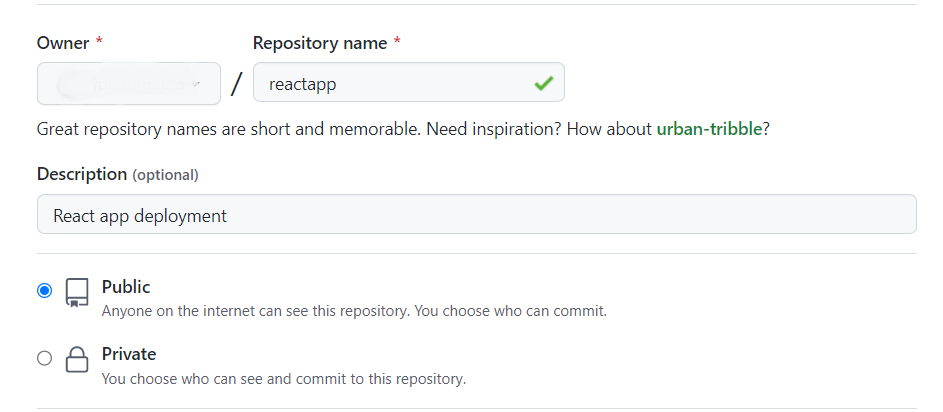
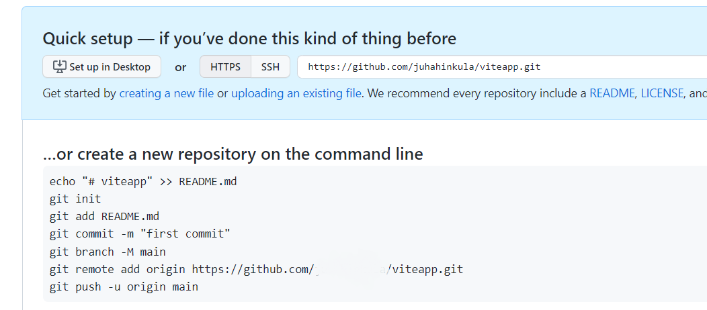
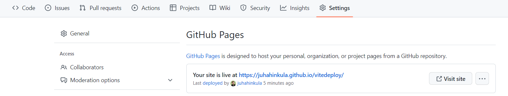

- The following steps demonstrates how you can deploy your Vite app to the **GitHub pages**.

#### 1. Create a repository 
- Create a repository to GitHub for your react app. In this example, I name my repository to ***reactapp***.


#### 2. Push your code to Github 
- Push your code to Github by using the commands from your Github repository.


#### 3. Vite config 
- Open you app's vite.config.js file and add the `base` property. The value is the name of your repository with leading and trailing slashes.
```js
export default defineConfig({
  //highlight-next-line
  base: '/reactapp/',
  plugins: [react()],
  test: {
    globals: true,
    environment: 'jsdom',
  },
})

```
#### 4. Install gh-pages 
- Navigate to your app folder in your terminal and install ***gh-pages*** npm package as a development dependency (https://github.com/tschaub/gh-pages).

```bash
npm install gh-pages --save-dev
```
#### 5. Deployment scripts 
- Add the deployment scripts to your package.json file.
```json
 "scripts": {
    "dev": "vite",
    "build": "vite build",
    "preview": "vite preview",
    //highlight-next-line
    "predeploy": "npm run build",
    //highlight-next-line
    "deploy": "gh-pages -d dist"
  },
```
#### 6. Deploy
- Deploy your app to Github pages using the following command:
```bash
npm run deploy
```
- The format of your app URL is the following.

```
https://{username}.github.io/{repo_name}/
```
- You can find the url from your repository's **Settings | Pages**


Different cloud service providers have their own deployment processes
For example,
- Azure:
https://azure.microsoft.com/en-in/resources/videos/build-and-deply-nodejs-and-react-apps-with-vscode-appservice-and-cosmosdb/
- AWS:
https://aws.amazon.com/getting-started/tutorials/deploy-react-app-cicd-amplify/
- Heroku:
https://blog.heroku.com/deploying-react-with-zero-configuration


