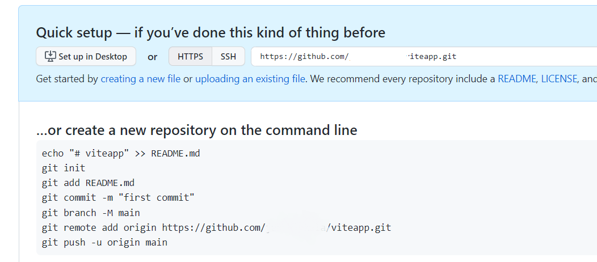

The following steps demonstrates how you can deploy your Vite app to the **GitHub pages**.

#### 1. Create a repository 
Create a repository to GitHub for your react app. In this example, I name my repository to ***reactapp***.


#### 2. Push your code to Github 
Push your code to Github repository you just created by using the commands shown in your Github repository.


#### 3. Project config 
Open your app's `vite.config.ts` file and add the `base` property. The value is the name of your repository with leading and trailing slashes.
```js title="vite.config.ts"
export default defineConfig({
  //highlight-next-line
  base: '/{repo-name}/',
  plugins: [react()],
  test: {
    globals: true,
    environment: 'jsdom',
  },
})
```
Open you app's `package.json` file and add the `homepage` property. Use your Github username and repository name.

```json
"homepage": "https://{username}.github.io/{repo-name}/"
```
:::note[If the project uses React Router: Note 1 ]
  GitHub Pages does not support React Router `browserRouter`. You can use `hashRouter` from the same library instead.
:::

:::note[If the project uses React Router: Note 2]
  Since the application is configured to be deployed to a subdirectory (the `base` definition above), it is necessary to tell the router what the base path is. It can be defined by giving `createBrowserRouter`/`createHashRouter` a second parameter that defines the basename. Refer to [React Router createBrowserRouter documentation](https://reactrouter.com/en/main/routers/create-browser-router#basename) for more information.

  Vite sets the base path in environment variable `BASE_URL`. You can define the second parameter using the environment variable  as follows to make routing work both on localhost and in the publishing environment:

  ```js
  {
    basename: import.meta.env.BASE_URL
  }
  ```
:::

#### 4. Install gh-pages 
Navigate to your app folder in your terminal and install `gh-pages` npm package as a development dependency (https://github.com/tschaub/gh-pages).

```bash
npm install gh-pages --save-dev
```
The `gh-pages` library is a Node.js package that provides a simple way to publish files to a `gh-pages` branch on GitHub. This branch is often used to host static websites directly from a GitHub repository using GitHub Pages.

#### 5. Deployment scripts 
Add the deployment scripts to your package.json file.
```json title="package.json"
 "scripts": {
    "dev": "vite",
    "build": "vite build",
    "preview": "vite preview",
    //highlight-next-line
    "predeploy": "npm run build",
    //highlight-next-line
    "deploy": "gh-pages -d dist"
  },
```
#### 6. Deploy
Deploy your app to Github pages using the following command:
```bash
npm run deploy
```
After the succesfull deployment, your app URL is the following.
```
https://{username}.github.io/{repo_name}/
```
You can find the url from your repository's **Settings | Pages**


---
### Further reading
- https://vite.dev/guide/static-deploy.html
- https://github.com/tschaub/gh-pages
- https://docs.github.com/en/pages