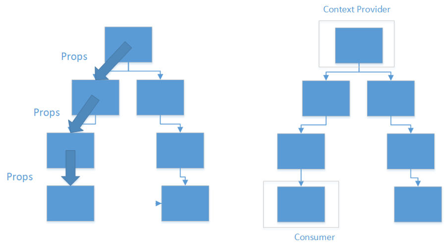

The **Context API** in React is a way to manage and share state across multiple components without the need to pass props down the component tree. It is useful for handling global or shared state, such as user authentication status, theme, or any data that multiple components need access to.

Using the props vs Context API:


To start using context, you need to create if first. You typically define this in a separate file. The `createContext` is used to create a context that components can provide to read. It takes one argument that is the default value.

```ts title="ThemeContext.ts"
import { createContext } from 'react';

type Theme = "light" | "dark"

const ThemeContext = createContext<Theme>("light");

export default ThemeContext;
```
The `createContext` returns a context object that has `Provider` and `Consumer` properties. The `Provider` property is used to provide context value to components.

Next, we create **context provider** that holds the shared value. It can be used to provide value to its child components.

```js title="ThemeProvider.ts"
import React, { useState } from 'react';
import ThemeContext from './ThemeContext';

const ThemeProvider = ({ children }) => {
  const [theme, setTheme] = useState("light");

  const toggleTheme = () => {
    setTheme((prevTheme) => (prevTheme === "light" ? "dark" : "light"));
  };

  return (
    <ThemeContext.Provider value={{ theme, toggleTheme }}>
      {children}
    </ThemeContext.Provider>
  );
};

export default ThemeProvider;
```
Now, any component within `ThemeProvider` can access the context usint the React `useContext` hook function.  
```jsx
import { useContext } from 'react';
import ThemeContext from './ThemeContext';

const MyComponent = () => {
  const { theme, toggleTheme } = useContext(ThemeContext);

  return (
    <>
      <button onClick={toggleTheme}>Change theme</button>
      <p>Current theme is: {theme}</p>
    </>
  );
};

export default MyComponent;
```
---
### Further Reading
- https://react.dev/learn/passing-data-deeply-with-context