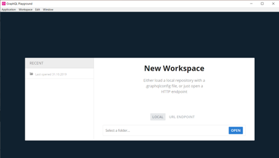
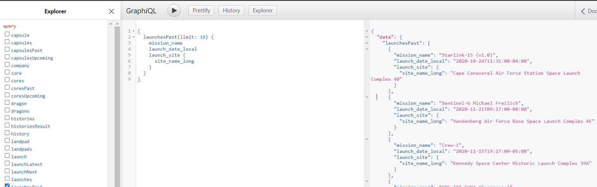
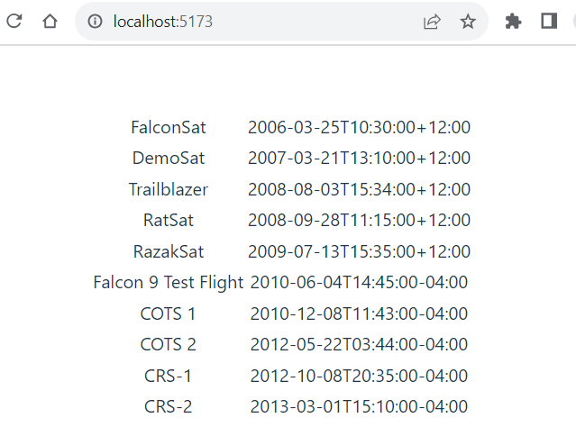

- GraphQL is query language for API and server-side runtime for execute queries (https://graphql.org/). 
- It is developed by Meta (former Facebook) and it is open source since 2016.
- GraphQL use schemas to describe the complete data.
- You can query exactly what you need using GraphQL queries.
- GraphQL API has typically one endpoint for all query calls (vs. Rest API multiple endpoints for different data).

For example, if we have `user` data object in a server we can make the following query. You can specify the fields you want to retrieve for the user:
```js
{
  user {
    username,
    email,
    phone
  }
}
```
- The query returns data as JSON objects:
```json
{
  "data": {
    "user": {
      "username": "john",
      "email": "john@mail.com",
      "phone": "123456"
    }
  }
}
```
- You can also specify query arguments for example, where id = 1.
```js
{
  user(id: 1) {
    username,
    email,
    phone
  }
}
```
- Read more about GraphQL queries https://graphql.org/learn/queries/
- Download GraphQL IDE like **GraphQL Playground** (https://github.com/prisma-labs/graphql-playground)
- You can use that to explore GraphQL APIs (Schema, Docs) and execute queries.


### GraphQL example (SpaceX GraphQL API)
- https://spacex-production.up.railway.app/
- GraphQL query to get 10 past launches (mission name, date, site) from the API:
```
{
  launchesPast(limit: 10) {
    mission_name
    launch_date_local
    launch_site {
      site_name_long
    }
  }
}
```
- You can test the query using the GraphQL playground.

- Create a new React app using the Vite.
- Install the Apollo Client (https://www.apollographql.com):
```bash
npm install @apollo/client graphql
```
- Apollo Client is the library that you can use to make requests using the GraphQL queries. 
- Add the following imports to the **main.jsx** file:
```js title="main.jsx"
import {
  ApolloClient,
  ApolloProvider,
  InMemoryCache,
} from "@apollo/client";
```
- Initialize Apollo client in your **main.jsx** file using the uri of the GraphQL jobs API. The `cache` property is used to store resultset locally:
```js title="main.jsx"
const client = new ApolloClient({
  uri: 'https://spacex-production.up.railway.app/',
  cache: new InMemoryCache()
});
```
- Then, we will wrap our `App` with an `ApolloProvider` component:
```jsx title="main.jsx"
ReactDOM.createRoot(document.getElementById('root')).render(
  <React.StrictMode>
    <ApolloProvider client={client}>
      <App />
    </ApolloProvider>
  </React.StrictMode>,
)
```
- Now, we can start to use Apollo client in our `App` component. First, add the following import:
```js
import {
  useQuery,
  gql,
} from "@apollo/client";
```
- The `gql` is used to define GraphQL query strings.
- The `useQuery` hook is used to execute GraphQL queries.
- Next, we will define the query string to retrieve 10 SpaceX launches from the past.
```js title="App.jsx"
const GET_LAUNCHES = gql`
  query GetLaunches {
    launchesPast(limit: 10) {
      mission_name
      launch_date_local
    }
  }
`;
``` 
- Then, we can execute the query using the `useQuery` hook by passing the query string as an argument:
```js title="App.jsx"
const { loading, error, data } = useQuery(GET_LAUNCHES);
```
- The `loading` is `true` when query is finished and resultset is available in the `data`. That can be used in conditional rendering.
```jsx title="App.jsx"
if (loading) return <p>Loading...</p>;
else if (error) return <p>Error...</p>
else {
  return (
    <table>
      <tbody>
        {data.launchesPast.map((launch, index) =>
          <tr key={index}>
            <td>{launch.mission_name}</td>
            <td>{launch.launch_date_local}</td>
          </tr>)}
      </tbody>
    </table>
  );
}
```
- Now, your `App` component should look like the following screenshot:
