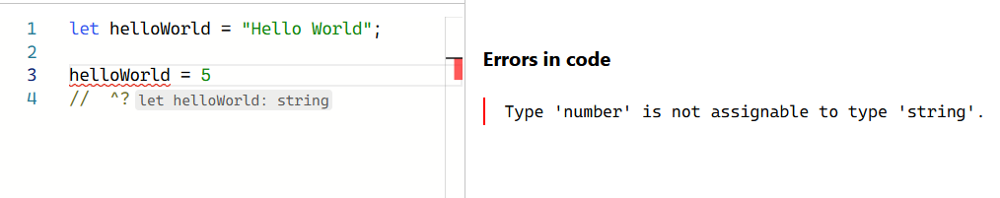
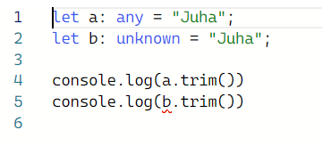
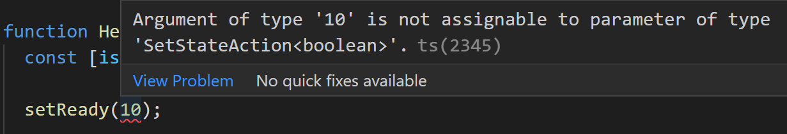
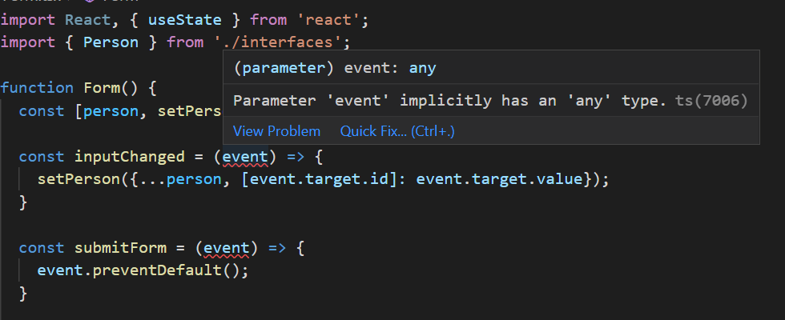

### TypeScript - Basics
- TypeScript is strongly typed programming language (https://www.typescriptlang.org/) that is based on JavaScript.
- Benefits of using TypeScript:
  - Catch errors before pushing your code to production.
  - Code is easier to understand and refactor/maintain.
  - Provides more information to developer (Self documented)
  - More popular nowadays (Great skill)
- You can try TypeScript in your browser:  https://www.typescriptlang.org/play
- You can install TypeScript into your project using the npm:
```bash
npm install typescript --save-dev
```
- Then you can run TypeScript compiler using the following command:
```bash
npx tsc
```
- You can also install TypeScript globally and then `tsc` command is available in all locations in your terminal.
- VSCode provides nice features for TS development. Read mode here: https://code.visualstudio.com/docs/languages/typescript

 #### Type inference
- TypeScript will automatically define the type when you initialize a variable. In the following example, we declare variable `helloworld` and assign it to a string value. If we try to re-assign it with other type, we get an error.

 

- The most common primitive types are: `string`, `number` and `boolean`
- See the different types: https://www.typescriptlang.org/docs/handbook/2/everyday-types.html
---
- You can also set explicit type to a variable:
```ts
let name: string;
let age: number;
```
- You can check the type using the `typeof`:
```ts
typeof name === "string" // true
typeof age === "number" // true
```
- If the type is not known when you write code, you can use `unknown` type.
```ts
let a: unknown = 10;
a = "It should be string";
```
- If you want to exlude type checking, you can use `any` type. 
```ts
let a: any = 10;
```
- `unknown` vs `any`
  - The `any` type allows to assign anything - The `any` type allows to operate anything.
  - The `unknown` type allows to assign anything - The `unknown` type doesn't allow to operate anything (Needs type check).
 

#### Functions
- You can define the type of parameters and return value
```ts
function calc(x: number, y: number): number {
  return x * y;
}
```
- In JavaScript function parameters are optional by default.
- In TypeScript, you will get an error if you don't pass all function parameters. To make function parameter optional, you can use `?` after the parameter name.

```ts
function sayHello(name: string, age?: number): string {
  if (!age)
    return `Hello ${name}`;
  
  return `Hello ${name}, you are ${age} year(s) old`
}
```
- Now, you can call function in the following ways:
```ts
sayHello("John");
// or
sayHello("John", 20);
```
- If there is no return value, you can use the `void` keyword:
```ts
(name: string) => void
```
#### Arrays
- Arrays are declared with the following syntax:
```ts
const arr: type[];
```
- For example:
```ts
let names: string[];
names = ["John", "Lisa", "Mike"];

// You can also use Array() constructor
let nums: number[] = new Array(10);
nums[0] = 4;
```
- You can also combibe more complex types
- Unions:
```ts
type MyStates = "awake" | "sleep" | "eating";
```
- Generics:
```ts
type NumArray = Array<number>
```
#### Structural types
- Structural types (define entities) are used a lot with React. For example, typing component props.
- You can use `interface` or `type` keyword.

```ts
interface Person {
  name: string;
  age: number;
}

type Point = {
  x: number;
  y: number;
}
```
- See the difference between types and interfaces: https://www.typescriptlang.org/docs/handbook/2/everyday-types.html#differences-between-type-aliases-and-interfaces
---
- If you have nested objects in your entities, for example:

```ts
interface Person {
  name: string;
  age: number;
  address: {
    street: string;
    number: number;
    zip: number;
  }
}
```
- Instead of using nested object, you can create `Address` interface

```ts
interface Address {
  street: string;
  number: number;
  zip: number;
}

interface Person {
  name: string;
  age: number;
  address: Address;
}
```
---
### React & TypeScript

- You can use TypeScript in your Vite React project by selecting **TypeScript** variant when creating a Vite project:
```
npm create vite@latest
```
---
#### Component props
- You can define the type for the function component `props` (=function arguments)

```tsx
interface HelloProps {
  name: string;
  age: number;
}

function Hello({name, age}: HelloProps) {
  return(
    <div>
      Hello {name}, you are {age} years old!
    </div>
  )
}

export default Hello;
```
- Now, if you pass value that doesn't match to defined type, you will get an error.


- You can define optional props using the `?`, for example:

```tsx
interface HelloProps {
  name: string;
  age?: number;
}

function Hello({name, age}: HelloProps) {
  return(
    <div>
      Hello {name}
      { age && <>, you are {age} years old!</>}   
    </div>
  )
}

export default Hello;
```
- If the props value is a function, the definition is following:

```ts
interface HelloProps {
  name: string;
  age?: number;
  myFunc: () => void; // no parmeters and return value
}
```

```ts
interface HelloProps {
  name: string;
  age?: number;
  myFunc: (msg: string) => void; // function parmeters
}
```
---
#### Function components
- You can also define the return type for your component and you will get an error if something else is returned.
```tsx
interface HelloProps {
  name: string;
  age: number;
}

function Hello({name, age}: HelloProps): JSX.Element {
  return(
    <div>
      Hello {name}, you are {age} years old!
    </div>
  )
}

export default Hello;
```
---
#### useState hook
- Type interference works with useState hooks function. For example, if you declare following state:
```ts
const [isReady, setReady] = useState(false);
```
- Now, if you update the state using wrong type, you will get an error:
```ts
setReady(10);
```


- If you have complex state, you can use `interface`, for example:

```ts
// declare interface
interface IUser {
  firstname: string,
  lastname: string,
  age: number
}

// useState hook
  const [user, setUser] = useState<IUser | null>(null);
// or if nullish values are not accepted
  const [user, setUser] = useState<IUser>({} as IUser);

```
- You can also explicitly define types. For example, if you want to initialize state with `null` or `undefined` value.

```ts
const [value, setValue] = useState<string | undefined>(undefined);
```
- Specifying type for array state
```ts
const [values, setValues] = useState<Array<string>>([]);

```
---
#### Forms & Events
- In the example below, the `inputChanged` function is used to handle input element change events. In TypeScript, you have to define event types, otherwise you will the following error.



- The type for input element change event is `React.ChangeEvent` 
- The type for form submit event is `React.FormEvent`, like shown in the following code.

```ts
  const handleChange = (event: React.ChangeEvent<HTMLInputElement>) => {
    setPerson({...person, [event.target.id]: event.target.value});
  }

  const handleSubmit = (event: React.FormEvent<HTMLFormElement>) => {
    event.preventDefault();
    // Do something with data
  }
```
- The whole `Form` component source code: https://github.com/juhahinkula/reactts/blob/main/src/Form.tsx

- If you have interfaces or types that are common to multiple files, you can define these in a separate file and use `export`.

```ts
// interfaces.ts 
export interface Address {
  street: string;
  number: number;
  zip: number;
}

export interface Person {
  name: string;
  age: number;
  address: Address;
}
```
- Then you can import interfaces to modules where these are used:

```ts
import { Person } from './interfaces';
```
---
### Further reading
- React TypeScript Cheatsheets  https://react-typescript-cheatsheet.netlify.app/
