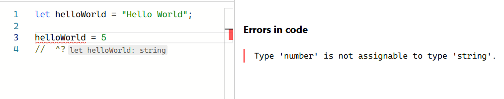

### TypeScript - Basics

In this course, we are using TypeScript. If you are not familiar with TypeScript, this chapter gives brief introduction to TypeScript. You can also read Microsoft tutroial **TypeScript for JavaScript Programmers**: https://www.typescriptlang.org/docs/handbook/typescript-in-5-minutes.html

TypeScript is strongly typed programming language (https://www.typescriptlang.org/) that is based on JavaScript.

Benefits of using TypeScript:
  - Catch errors before pushing your code to production.
  - Code is easier to understand and refactor/maintain.
  - Provides more information to developer (Self documented)
  - More popular nowadays (Great skill)

You can try TypeScript in your browser: https://www.typescriptlang.org/play

You can install TypeScript into your project using the npm:
```bash
npm install typescript --save-dev
```
Then you can run TypeScript compiler using the following command:
```bash
npx tsc
```
You can also install TypeScript globally and then `tsc` command is available in all locations in your terminal.

VSCode provides useful features for TS development. Read more here: https://code.visualstudio.com/docs/languages/typescript

#### Type inference

TypeScript will automatically define the type when you initialize a variable. In the following example, we declare variable `helloworld` and assign it to a string value. If we try to re-assign it with other type, we get an error.



The most common primitive types are: `string`, `number` and `boolean`.

See the different types: https://www.typescriptlang.org/docs/handbook/2/everyday-types.html

You can set explicit type to a variable:
```ts
let name: string
let age: number
```
You can check the type using the `typeof`:
```ts
typeof name === "string" // true
typeof age === "number" // true
```
If the type is not known when you write code, you can use `unknown` type.
```ts
let a: unknown = 10
a = "It should be string"
```
If you want to exlude type checking, you can use `any` type.
```ts
let a: any = 10
```
The `unknown` type is a safer alternative to `any`. It represents any value, but you cannot perform operations on it without first asserting its type. The code below demonstrates the difference between `any` and `unknown`.

Using `unknown`:

```ts
let value: unknown

value = 42 // This is OK
value = "hello" // This is OK
value = true // This is OK

// Type checking is required before using the value
if (typeof value === "number") {
  let num: number = value
}
```

Using `any`:

```ts
let value: any

value = 42 // This is OK
value = "hello" // This is OK
value = true // This is OK

// Type checking is not required
// This is OK, but potentially unsafe
let num: number = value
```

#### Functions
You can define the type of parameters and return value
```ts
function calc(x: number, y: number): number {
  return x * y
}
```
In JavaScript function parameters are optional by default. In TypeScript, you will get an error if you don't pass all function parameters. To make function parameter optional, you can use `?` after the parameter name.
```ts
function sayHello(name: string, age?: number): string {
  if (!age) return `Hello ${name}`

  return `Hello ${name}, you are ${age} year(s) old`
}
```
Now, you can call function in the following ways:
```ts
sayHello("John")
// or
sayHello("John", 20)
```
- If there is no return value, you can use the `void` keyword:
```ts
function logMessage(message: string): void {
  console.log(message)
}
```
#### Arrays
Arrays are declared with the following syntax:
```ts
const arr: type[]
```
For example:
```ts
let names: string[]
names = ["John", "Lisa", "Mike"]

// You can also use Array() constructor
let nums: number[] = new Array(10)
nums[0] = 4
```
You can also use generic array type `Array<typeOfElement>`:
```ts
let names: Array<string> = ['Lisa', 'Mike', 'Greg'];
```
#### Union types
You can combine more complex types using union types:
```ts
type MyStates = "awake" | "sleep" | "eating"

type AppStatus = "success" | "error" | "loading";
```
The `|` operator defines a union of string values. It allows only three possible string values: "awake", "sleep", or "eating". That can be used to ensure that variables only contain these specific values.

#### Structural types
Structural type are used a lot with React. For example, typing component props or complex states. To define strutural types, you can use `interface` or `type` keyword.
```ts
interface Person {
  name: string;
  age: number;
}

type Point = {
  x: number;
  y: number;
}
```
See the difference between types and interfaces: https://www.typescriptlang.org/docs/handbook/2/everyday-types.html#differences-between-type-aliases-and-interfaces.

If you have nested objects in your entities, for example:
```ts
type Person = {
  name: string;
  age: number;
  address: {
    street: string;
    number: number;
    zip: number;
  }
}
```
Instead of using nested object, you can create `Address` type
```ts
type Address = {
  street: string;
  number: number;
  zip: number;
}

type Person = {
  name: string;
  age: number;
  address: Address;
}
```

---
### Further reading
- https://www.typescriptlang.org/
- https://react-typescript-cheatsheet.netlify.app/
