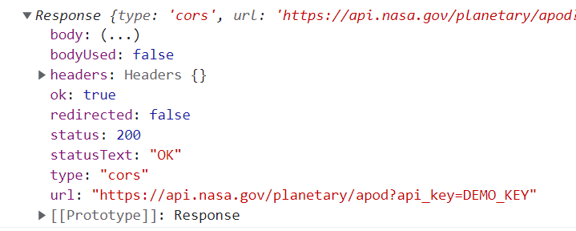

### Fetch API
- **Fetch API** can be used to handle web requests, and it is supported by modern browsers natively.
- Fetch takes a URL as its first argument.
- Fetch is an asynchronous operation; and it provides promises that make response handling easier.
- The `catch` handles network errors (offline, etc.).
```js
fetch('https://mydomain.com/api')
.then(response => {
  // Handle response
})
.catch(err => {
  // Something went wrong
});
```
- In the successful request we can extract the JSON data from a request by using **`json()`** function.
```js
fetch('https://mydomain.com/api')
.then(response => response.json())
.then(data => {
  // Handle data
})
.catch(err => {
  // Something went wrong
});
```
---
### Response
- The `response` is an object that contains following properties: body, headers, status, etc. (https://developer.mozilla.org/en-US/docs/Web/API/Response)
```js
fetch('https://mydomain.com/api')
.then(response => console.log(response))
```
 

---
### Setting HTTP method & headers
- You can also pass second argument to `fetch` function that is an optional object containing options to configure the request.
- By default, `fetch` sends GET request. You can use `method` property to use different request methods.
- Request headers give the server information about the request, for example format of the request body. The `headers` property can be used to set request headers.
- The request body is the payload of the request for example, the data that client is sending to the server. To set request body, you can use `body` property.

```js
fetch('https://mydomain.com/api', {
  method: 'POST', 
  headers: { 
    'Accept': 'application/json', 
    'Content-Type': 'application/json', 
  },
  body: JSON.stringify({ message: 'Hello World!' })
})
.then(response => {
  // Handle response
})
.catch(err => {
  // Something went wrong
});
```
---
### Response status
- You should also check the response status.
- `response.ok` returns true if the response status is 2XX.
```js 
fetch('https://mydomain.com/api')
.then(response => {
  if (!response.ok) 
    throw new Error(response.statusText)
  
  return response.json()
})
.then(data => {
  // Handle data
})
.catch(err => {
  // Something went wrong
});
```
---
### async / await
- In this material, we use `then` statements, but you can use `async/await` as well to handle promises.
```js
const fetchData = async () => {
  try {
    const response = await fetch('https://mydomain.com/api');
    const data = await response.json();
  }
  catch(error) {
    console.error(error);
  }
}
```
---
### Further reading
- **Axios** https://axios-http.com/ Popular JavaScript library for HTTP requests.
- **React Query**: *"React Query is often described as the missing data-fetching library for React, but in more technical terms, it makes fetching, caching, synchronizing and updating server state in your React applications a breeze."* 
https://tanstack.com/query
