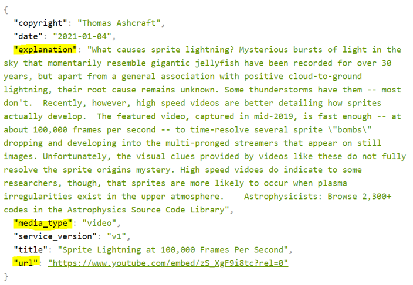
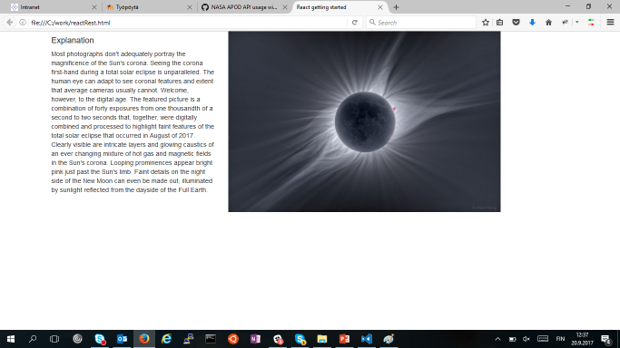

- The following example uses **NASA APOD** API that shows astronomy picture or video of the date. (https://api.nasa.gov/)
- The example makes call to rest api and shows daily image and explanation in the page
- Rest API can be called by using following URL:
https://api.nasa.gov/planetary/apod?api_key=DEMO_KEY
- The call response returns explanation and image URL as JSON format. The media_type field can be used to check if the response contains video or image.

The response data looks like the image below:



- We will create React app that calls the NASA APOD API and displays the daily image and the explanation.
- We need a state to store data from the response (image url, explanation and type of a media).
```js
// State for response data
const [data, setData] = React.useState({});
```

- The fetch API call is made inside the `useEffect` hook and the second argument is an empty array because we want to send request only once after the firs render.
- When the response arrives, the response data is saved to the `data` state and UI is re-rendered automatically by React.
- **Note!** We want to call API only once when the component has been rendered first time. Therefore we have to pass `[]` to the `useEffect` hook function:
```js
React.useEffect(() => {
  fetch('https://api.nasa.gov/planetary/apod?api_key=DEMO_KEY')
  .then(response => response.json())
  .then(responseData => setData(responseData))
  .catch(err => console.error(err))
}, []);

```
- Then, we will use conditional rendering. We will check the `media_type` and render either image or video:
```js
if (!data.media_type) {
  return <p>Loading...</p>
}
else if (data.media_type === "image") {
  return (
    <div>
      <p>Explanation: {data.explanation}</p>
      
    </div>
  );
}
else {
  return (
    <div>
      <p>Explanation: {data.explanation}</p>
      <iframe width="520" height="415" src={data.url}></iframe>
    </div>
  );
}
```
- Or using inline conditional rendering
```js
if (!data.media_type) {
  return <p>Loading...</p>
}
else {
  return (
    <div>
      <p>Explanation: {data.explanation}</p>
      { data.media_type === 'video' && <iframe width="520" height="415" src={data.url}></iframe> }          
      { data.media_type === 'image' &&  }
    </div>
  );
}
```
Source code: http://bit.ly/2HuoPR7 



:::note
In the NASA APOD example we made network request using the `useEffect` hook because we wanted to show apod image when component is rendered. If request requires some user input for example, user have to press some button, then request can be invoked in the button's `onClick` event handler and `useEffect` is not needed.
:::
---
### Further reading
- **React Query**: *"React Query is often described as the missing data-fetching library for React, but in more technical terms, it makes fetching, caching, synchronizing and updating server state in your React applications a breeze."* 
https://tanstack.com/query
- **Axios** https://axios-http.com/