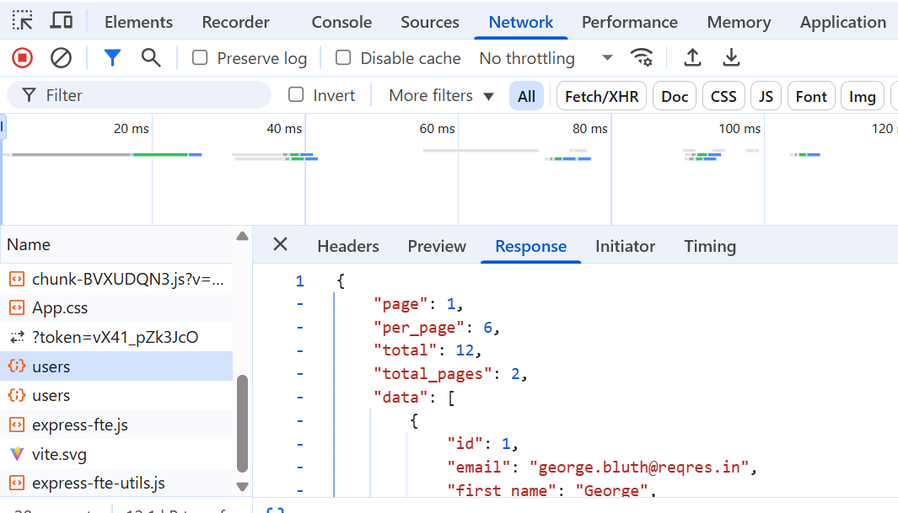
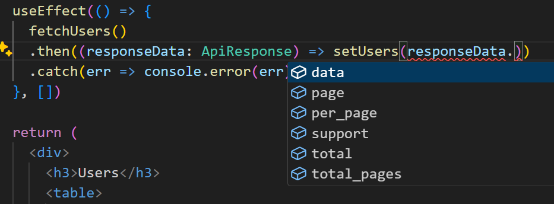

### User lists
The next example fetches an array of user objects from the REST API and store it to React state. The REST API to be used is **Reqres.in** fake API, and the following URL returns a list of fake users (https://reqres.in/api/users).


Let's define a type for the user object:

```ts
type User = {
  id: number;
  email: string;
  first_name: string;
  last_name: string;
  avatar: string;
}
```
We need an array to store a list of users; therefore, we create a state called `users` and initialize that to an empty array. Then, we use the `useEffect` hook to send a request once after the first render.

Reqres.in requires an API key to be included in the request headers, which you can get for free. To add headers to your request, use the second argument of the `fetch` function and specify the `headers` property. You can find header in https://reqres.in/signup.
```ts
const [users, setUsers] = useState<User[]>([]);

useEffect(() => {
  fetch('https://reqres.in/api/users', {
    headers: { 'x-api-key': 'reqres-free-v1' }
  })
  .then(response => {
    if (!response.ok)
      throw new Error("Error in fetch: " + response.statusText);
  
    return response.json();
  })
  .then(responseData => setUsers(responseData.data))
  .catch(err => console.error(err))
}, [])
```
Now, if you open the developer console in your browser and navigate to the **Network** tab, you can see the requests made by the component. You will find the `users` request triggered by our component. The response payload is also displayed in the console. You might notice that the `users` request is executed twice. This behavior is due to `React.StrictMode` that is enabled in the `main.tsx` file. `React.StrictMode` invokes certain lifecycle methods twice during development to help identify potential issues. This behavior is specific to the development environment and will not occur in the production build of your application.



The `return` statement looks the following. Each user object includes a unique `id`, which is used as the `key` for each table row:
```tsx
return (
  <>
    <h2>Users</h2>
    <table>
      <thead>
        <tr>
          <th>First Name</th>
          <th>Last Name</th>
          <th>Email</th>
        </tr>
      </thead>
      <tbody>
        {users.map((user: User) => (
          <tr key={user.id}>
            <td>{user.first_name}</td>
            <td>{user.last_name}</td>
            <td>{user.email}</td>
          </tr>
        ))}
      </tbody>
    </table>
  </>
)
```
Now, the list should look like the following screenshot:


### Typing fetch & Refactoring
We can define types to represent the structure of the API response. Next, we will learn how to perform type-safe fetching using the same Reqres.in REST API as before. 

The response data looks the following:
```json
{
  "page": 1,
  "per_page": 6,
  "total": 12,
  "total_pages": 2,
  "data": [
    {
      "id": 1,
      "email": "george.bluth@reqres.in",
      "first_name": "George",
      "last_name": "Bluth",
      "avatar": "https://reqres.in/img/faces/1-image.jpg"
    },
    {
      "id": 2,
      "email": "janet.weaver@reqres.in",
      "first_name": "Janet",
      "last_name": "Weaver",
      "avatar": "https://reqres.in/img/faces/2-image.jpg"
    },
    {
      "id": 3,
      "email": "emma.wong@reqres.in",
      "first_name": "Emma",
      "last_name": "Wong",
      "avatar": "https://reqres.in/img/faces/3-image.jpg"
    },
  ],
  "support": {
    "url": "https://contentcaddy.io?utm_source=reqres&utm_medium=json&utm_campaign=referral",
    "text": "Tired of writing endless social media content? Let Content Caddy generate it for you."
  }
}
```
We need to define a type to represent the structure of the REST API response:
```ts
export type ApiResponse = {
  page: number;
  per_page: number;
  total: number;
  total_pages: number;
  data: User[];
  support: {
    url: string;
    text: string;
  }
}
```
We can define the `responseData` with the `ApiResponse` type to ensure type safety:
```ts
useEffect(() => {
  fetch("https://reqres.in/api/users", {
    headers: { 'x-api-key': 'reqres-free-v1' }
  })
  .then((response) => {
    if (!response.ok) throw new Error(`Error in fetch: ${response.status}`)

    return response.json()
  })
  //highlight-next-line
  .then((responseData: ApiResponse) => setUsers(responseData.data))
  .catch((err) => console.error(err))
}, [])
```
Additionally, we can create own module to handle REST API functions. This approach is beneficial when the same request needs to be made in multiple components, as it avoids code duplication. It also simplifies REST API testing which is commonly made by mocking.

To improve reusability and maintainability, define the types in a separate module and export them for use in other parts of the application. you can also create a dedicated module (e.g., `userApi.ts`) to handle REST API interactions. In this approach, API logic is easier to manage and test.

For example, you can define and export the `User` and  `ApiResponse` types in a `types.ts` file:
```ts title="types.ts"
export type User = {
  id: number;
  email: string;
  first_name: string;
  last_name: string;
  avatar: string;
}

export type ApiResponse = {
  page: number;
  per_page: number;
  total: number;
  total_pages: number;
  data: User[];
  support: {
    url: string;
    text: string;
  };
};
```
Then, in the `userApi.ts` module, handle the API request logic:
```ts
import { ApiResponse } from "./types";

export const fetchUsers = (): Promise<ApiResponse> => {
  return fetch("https://reqres.in/api/users", {
    headers: { 'x-api-key': 'reqres-free-v1' }
  })
  .then((response) => {
    if (!response.ok) {
      throw new Error(`Error in fetch: ${response.status}`);
    }
    return response.json();
  });
}
```
The `fetchUsers` function returns a `Promise`. We can use generics to define value that Promise resolves and in our case it is `ApiResponse`. That's why function's return type is `Promise<ApiResponse>`.

When the `Promise` resolves, the resolved value will match the structure defined by the `ApiResponse` type. If you try to access properties on the resolved value that are not part of `ApiResponse`, TypeScript will throw a compile-time error.

Now, developers know exactly what to expect when the `Promise` resolves. You can also get autocompletion support for the ApiResponse type when type is defined.

Then, we can use `fetchUsers` function in `UserList` component.
```ts
useEffect(() => {
  fetchUsers()
  .then(responseData => setUsers(responseData.data))
  .catch(err => console.error(err))
}, [])
```
Now, you can see the TypeScript error if you try to access properties that doesn't exist in `ApiResponse`. You will also get autocompletion as shown in the following image:



:::info
You can also create custom hook to perform REST API call. Read more about custom hooks in https://react.dev/learn/reusing-logic-with-custom-hooks.
:::