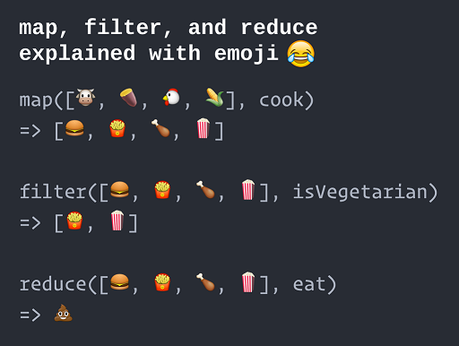
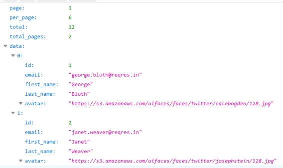
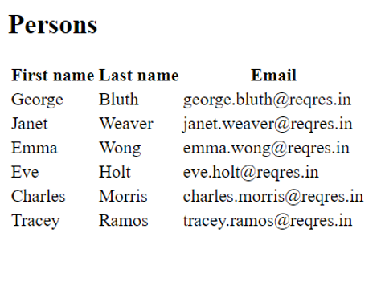

## map()
- First, it is good to learn JavaScript function that is really useful with arrays. 
- The `map()` function creates a new array with the results of calling a function for every array element.
```js
let arrA = [1, 2, 3];
let arrB = arrA.map(x => x * 2);
// arrB = [2, 4, 6]
```
- The `map` statement above returns a new array with values multiplied by 2.

- By Joe Devilla
(https://www.globalnerdy.com/2016/06/23/map-filter-and-reduce-explained-using-emoji/) 


---
<!-- _class: smaller -->

## List handling
- The following example creates a state that is array of numbers.
- Then, we render array of listitems in the return statement by using the `map` function.
- **Note!** `key` string attribute is needed in the lists. That helps react to identify which rows have changed. The `map` method has second argument that is running index and we use that in the following exampe.   
```jsx
const [numbers, setNumbers] = React.useState([1, 2, 3, 4, 5]);

return (
  <div>
    <ul>
      { numbers.map((number, index) =>
        <li key={index}>Listitem {number}</li>) }
    </ul>
  </div>
);

```
:::note
The usage of index is not recommended in proper apps because it can cause bugs if list is reordered or you add or delete list items. Instead of that you should use unique key from a data if that exists, There are also libraries available that you can use to generate unique id’s like uuid (https://github.com/uuidjs/uuid)
:::
---
### List handling example
- The next example fetch an array of listitems from the REST API and set it to react state.
- The REST API to be used is **Reqres.in** fake API and the following URL returns list of persons (https://reqres.in/api/users).


- We need an array to store list of persons; therefore, we create the state called `listItems` and initialize that to an empty array. Then, we use the `useEffect` hook to send a request once after the first render.
```js
const [listItems, setListItems] = React.useState([]);

//Fetch call is done inside the useEffect hook
React.useEffect(() => {
  fetch('https://reqres.in/api/users').then(response => response.json()) 
  .then(responseData => { 
    setListItems(responseData.data)
  }) 
  .catch(err => console.error(err)
}, [])
```
- The `return` statement looks the following:
```jsx
return (
  <div>
    <h2>Persons</h2>
    <table>
      <tbody>
        <tr><th>First name</th><th>Last name</th><th>Email</th></tr>
        { listItems.map((person) => 
            <tr key={person.id}>
              <td>{person.first_name}</td>
              <td>{person.last_name}</td>
              <td>{person.email}</td>
            </tr> }
      </tbody>
    </table>
  </div>
);
```
- The source code can be found in http://bit.ly/2kdCcwS


