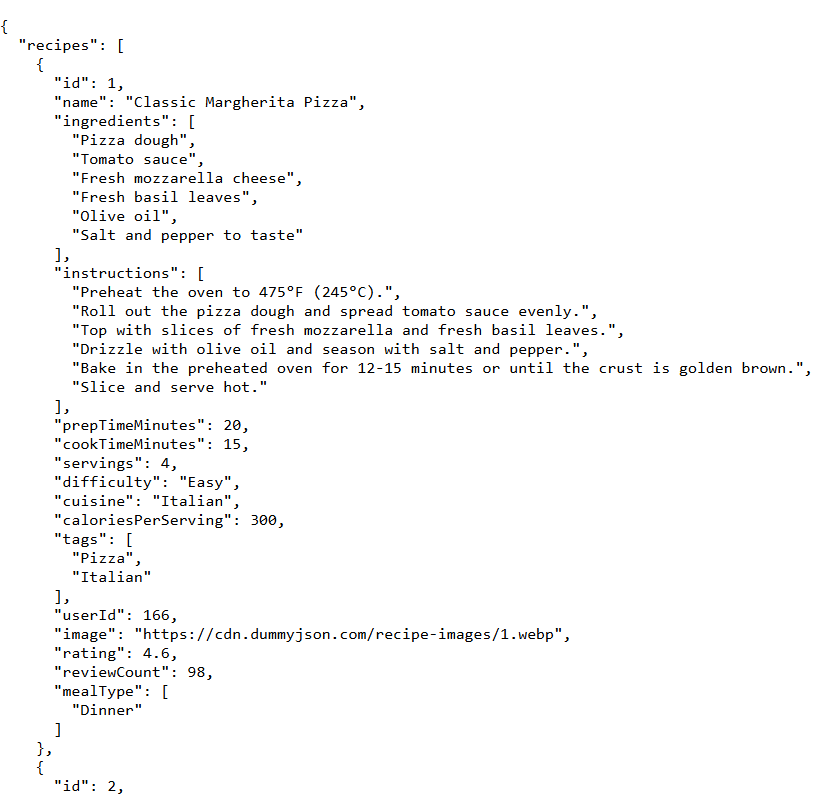
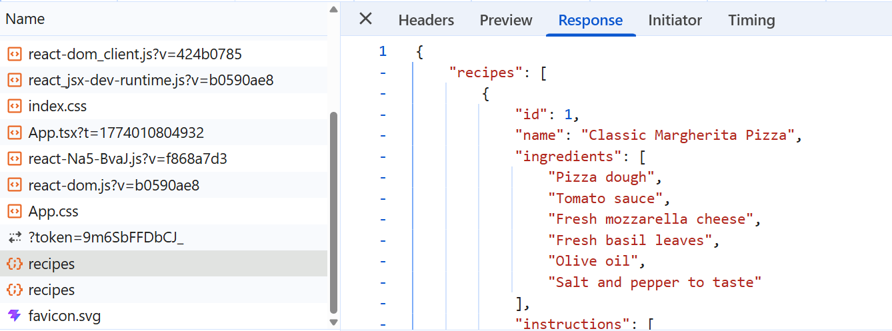
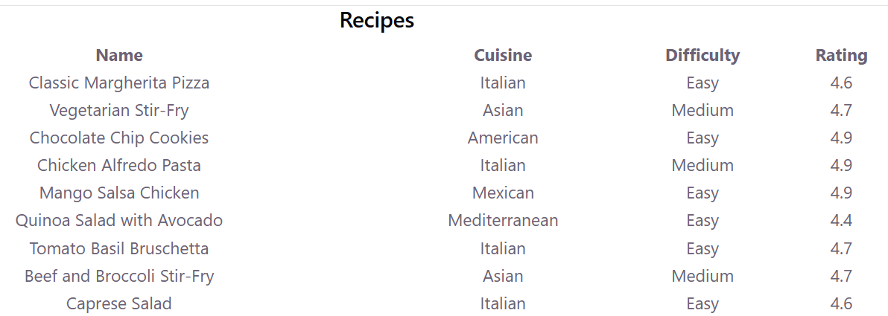

### Recipe list
The next example fetches an array of recipe objects from the REST API and stores it to React state. The REST API to be used is **DummyJSON** fake API, and the following URL returns a list of fake recipes (https://dummyjson.com/recipes).



Let's define a type for the recipe object. In this case, we only define fields that we are going to use in our component:

```ts
type Recipe = {
  id: number;
  name: string;
  cuisine: string;
  difficulty: string;
  rating: number;
}
```

We need an array to store a list of recipes; therefore, we create a state called `recipes` and initialize that to an empty array. Then, we use the `useEffect` hook to send a request once after the first render.

DummyJSON does not require authentication, so no API key is needed:

```ts
const [recipes, setRecipes] = useState<Recipe[]>([]);

useEffect(() => {
  fetch('https://dummyjson.com/recipes')
    .then(response => {
      if (!response.ok)
        throw new Error("Error in fetch: " + response.statusText);

      return response.json();
    })
    .then(responseData => setRecipes(responseData.recipes))
    .catch(err => console.error(err))
}, [])
```

Now, if you open the developer console in your browser and navigate to the **Network** tab, you can see the requests made by the component. You will find the `recipes` request triggered by our component. The response payload is also displayed in the console. You might notice that the `recipes` request is executed twice. This behavior is due to `React.StrictMode` that is enabled in the `main.tsx` file. `React.StrictMode` invokes certain lifecycle methods twice during development to help identify potential issues. This behavior is specific to the development environment and will not occur in the production build of your application.



The `return` statement looks like the following. Each recipe object includes a unique `id`, which is used as the `key` for each table row:

```tsx
return (
  <>
    <h2>Recipes</h2>
    <table>
      <thead>
        <tr>
          <th>Name</th>
          <th>Cuisine</th>
          <th>Difficulty</th>
          <th>Rating</th>
        </tr>
      </thead>
      <tbody>
        {recipes.map((recipe: Recipe) => (
          <tr key={recipe.id}>
            <td>{recipe.name}</td>
            <td>{recipe.cuisine}</td>
            <td>{recipe.difficulty}</td>
            <td>{recipe.rating}</td>
          </tr>
        ))}
      </tbody>
    </table>
  </>
)
```

Now, the list should look like the following screenshot:

 

### Typing fetch & Refactoring

We can define types to represent the structure of the API response. Next, we will learn how to perform type-safe fetching using the same DummyJSON REST API as before.

The response data looks like the following:

```json
{
  "total": 50,
  "skip": 0,
  "limit": 30,
  "recipes": [
    {
      "id": 1,
      "name": "Classic Margherita Pizza",
      "ingredients": [
        "Pizza dough",
        "Tomato sauce",
        "Fresh mozzarella cheese",
        "Fresh basil leaves",
        "Olive oil",
        "Salt and pepper to taste"
      ],
      "instructions": [
        "Preheat the oven to 475°F (245°C)...",
      ],
      "prepTimeMinutes": 20,
      "cookTimeMinutes": 15,
      "servings": 4,
      "difficulty": "Easy",
      "cuisine": "Italian",
      "caloriesPerServing": 300,
      "tags": [
        "Pizza",
        "Italian"
      ],
      "userId": 166,
      "image": "https://cdn.dummyjson.com/recipe-images/1.webp",
      "rating": 4.6,
      "reviewCount": 98,
      "mealType": [
        "Dinner"
      ]
    },
    // constinue...
```

We need to define a type to represent the structure of the REST API response:

```ts
export type RecipeResponse = {
  recipes: Recipe[];
  total: number;
  skip: number;
  limit: number;
}
```

We can type `responseData` with the `RecipeResponse` type to ensure type safety:

```ts
useEffect(() => {
  fetch('https://dummyjson.com/recipes')
    .then((response) => {
      if (!response.ok) throw new Error(`Error in fetch: ${response.status}`)

      return response.json()
    })
    //highlight-next-line
    .then((responseData: RecipeResponse) => setRecipes(responseData.recipes))
    .catch((err) => console.error(err))
}, [])
```

Additionally, we can create our own module to handle REST API functions. This approach is beneficial when the same request needs to be made in multiple components, as it avoids code duplication. It also simplifies REST API testing which is commonly done by mocking.

To improve reusability and maintainability, define the types in a separate module and export them for use in other parts of the application. You can also create a dedicated module (e.g., `recipeApi.ts`) to handle REST API interactions. In this approach, API logic is easier to manage and test.

For example, you can define and export the `Recipe` and `RecipeResponse` types in a `types.ts` file:

```ts title="types.ts"
export type Recipe = {
  id: number;
  name: string;
  cuisine: string;
  difficulty: string;
  rating: number;
}

export type RecipeResponse = {
  recipes: Recipe[];
  total: number;
  skip: number;
  limit: number;
}
```

Then, in the `recipeApi.ts` module, handle the API request logic:

```ts title="recipeApi.ts"
import { RecipeResponse } from "./types";

export const fetchRecipes = (): Promise<RecipeResponse> => {
  return fetch('https://dummyjson.com/recipes')
    .then((response) => {
      if (!response.ok) {
        throw new Error(`Error in fetch: ${response.status}`);
      }
      return response.json();
    });
}
```

The `fetchRecipes` function returns a `Promise`. We use generics to define the value that the Promise resolves to — in our case `RecipeResponse`. That's why the function's return type is `Promise<RecipeResponse>`.

When the `Promise` resolves, the resolved value will match the structure defined by the `RecipeResponse` type. If you try to access properties on the resolved value that are not part of `RecipeResponse`, TypeScript will throw a compile-time error.

Now, developers know exactly what to expect when the `Promise` resolves. You also get autocompletion support for the `RecipeResponse` type when the type is defined.

Then, we can use the `fetchRecipes` function in the `RecipeList` component:

```ts
useEffect(() => {
  fetchRecipes()
    .then(responseData => setRecipes(responseData.recipes))
    .catch(err => console.error(err))
}, [])
```

:::info
You can also create a custom hook to perform REST API calls. Read more about custom hooks at https://react.dev/learn/reusing-logic-with-custom-hooks.
:::