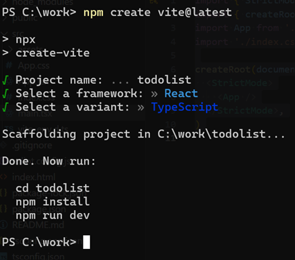
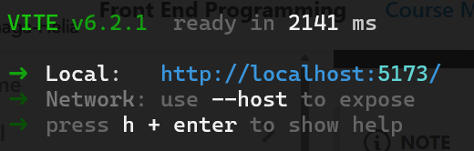
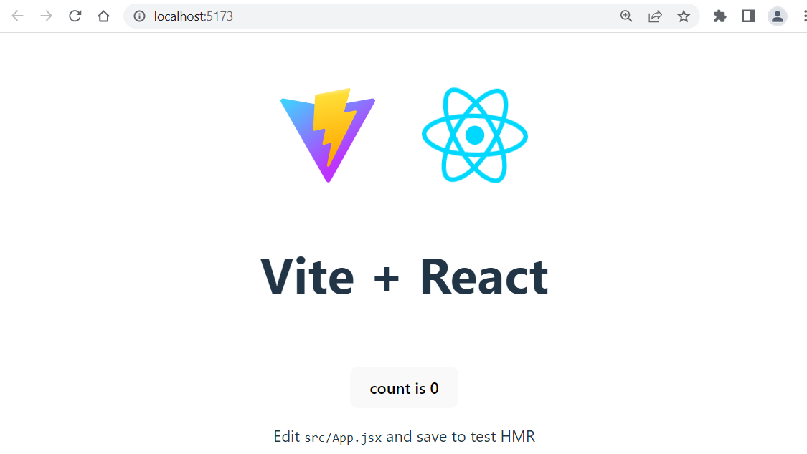
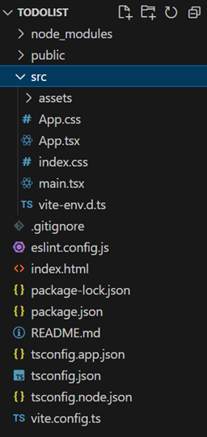
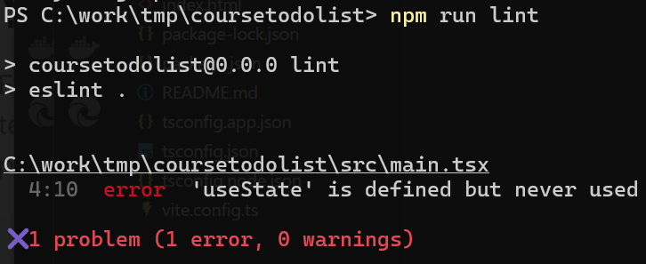
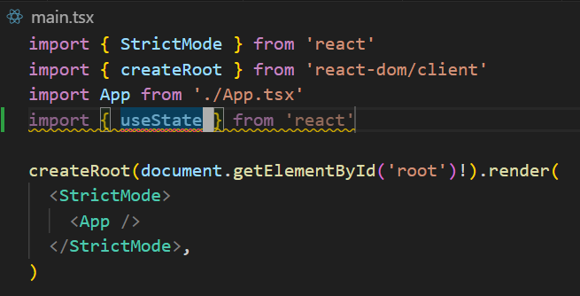

### General
There are multiple ways to create react app/project, such as:
- Vite.js
- Next.js
- Remix
- Gatsby
- etc. 

In this course, we are using **Vite** (https://vitejs.dev/) that is a build tool and web development framework for web applications. Vite.js is really fast and lightweight. That is a good solution for learning React.

Vite requires Node.js and you can execute the following commands in terminal to verify that Node.js is installed to your computer. If npm is installed, the terminal will display the installed version of npm.
```bash
node --version
```
You can check the Node.js version requirement in https://vite.dev/guide/.

Next.js, Remix, and Gatsby are React frameworks that provide a lot of features out of the box.

### Create Vite React project
You can create a new Vite project by entering the following npm command in command line:

```bash
npm create vite@latest
```
The command opens a project wizard where you can define a name of your project and framework. 

Select **React** framework and  **TypeScript** variant. SWC (Speedy Web Compiler) is a fast JavaScript and TypeScript compiler written in Rust. It is a faster alternative to Babel, which is normally used.



Next, you change the directory to your project folder and install the dependencies:
```bash
cd your_project
npm install
```
Finally, run the project in development mode:
```bash
npm run dev
```


:::note
You can stop the process by pressing **q** in the terminal
:::
Now, you can access the local URL displayed in the terminal using your web browser.

Vite provides HMR (Hot Module Replacement) which updates the page automatically when you make changes to javascript/typescript or css files.



---
### Project structure
Vite creates the following project structure. If you have a larger app with multiple components and functionalities, it is better to create separate folders for them. For example, you can create folders like `/components`, `/api`, etc.



#### App.tsx
The `App.tsx` file contains the React component that is displayed when you open the app in a web browser.
- `import` statements are used to import libraries, react components, stylesheet and assets to the component.
- `export` statement allows you to import component to another file by using the `import` statement
```jsx title="App.tsx"
import { useState } from 'react'
import reactLogo from './assets/react.svg'
import viteLogo from '/vite.svg'
import './App.css'

function App() {
  const [count, setCount] = useState(0)
  
  return(
    <>
      ...
    <>;
  );
}

export default App
```
#### Main.tsx
The `main.tsx` file imports the `App` component and renders it to `index.html` file’s `root` element. The `index.htm` file can be found from the root folder of your project.

```jsx title="main.tsx"
import { StrictMode } from 'react'
import { createRoot } from 'react-dom/client'
import App from './App.tsx'
import './index.css'

createRoot(document.getElementById('root')!).render(
  <StrictMode>
    <App />
  </StrictMode>,
)
```
- `ReactDOM` provides `createRoot` method that creates a 'root element' that is rendered into a html page. 
- In this example, `createRoot` is used to create a root at the DOM element with the id `root` and then the render method is used to render a React component (in this case, `App`) into that root. 
- The exclamation mark (`!`) is a TypeScript non-null assertion operator. It tells the TypeScript compiler that you are certain the expression `document.getElementById('root')` will not be `null`. This helps avoid TypeScript errors related to potential `null` values.

:::note
The `React.StrictMode` lets you find common bugs in your React app in the development phase. Due to strict mode, components will re-render extra time in the development mode to find bugs.
:::

#### index.html

```html title="index.html"
<!doctype html>
<html lang="en">
  <head>
    <meta charset="UTF-8" />
    <link rel="icon" type="image/svg+xml" href="/vite.svg" />
    <meta name="viewport" content="width=device-width, initial-scale=1.0" />
    <title>Vite + React + TS</title>
  </head>
  <body>
    <div id="root"></div>
    <script type="module" src="/src/main.tsx"></script>
  </body>
</html>
```

React provides `@types/react` and `@types/react-dom` packages that offer useful types for React. If you create Vite project using TypeScript, these packages are installed as development dependencies. There is also a configuration file `tsconfig.app.json` created in the Vite project for TypeScript, and it specifies the compiler options required to compile the project.

### package.json
The `package.json` file is a crucial file in a node.js project that contains metadata about the project and its dependencies. It is used by npm to manage the project dependencies, scripts, versioning, and other configurations.

```json
"dependencies": {
  "react": "^19.0.0",
  "react-dom": "^19.0.0"
},
"devDependencies": {
  "@eslint/js": "^9.21.0",
  "@types/react": "^19.0.10",
  "@types/react-dom": "^19.0.4",
  "@vitejs/plugin-react": "^4.3.4",
  "eslint": "^9.21.0",
  "eslint-plugin-react-hooks": "^5.1.0",
  "eslint-plugin-react-refresh": "^0.4.19",
  "globals": "^15.15.0",
  "typescript": "~5.7.2",
  "typescript-eslint": "^8.24.1",
  "vite": "^6.2.0"
  }
```
The `dependencies` section list all dependencies that your project needs. The `devDependencies` section in a `package.json` file lists the packages that are only needed for development and testing purposes, not for running th e actual application in production.

When you created your Vite project, you also executed the `npm install` command without any additional arguments. This command reads the dependencies listed in the `package.json` file and downloads them into your project. It creates a `node_modules` folder where all the required dependencies are stored.

### Linter

**Linters** in programming are tools designed to analyze source code and identify potential issues, coding style violations, and errors.

**ESLint** is popular linter for JavaScript and TypeScript. Vite is using ESLint by default. It is recommended to install ESLint extension to your VS Code (https://marketplace.visualstudio.com/items?itemName=dbaeumer.vscode-eslint). That integrates ESLint to your VS Code.

You can find the ESLint configuration file `eslint.config.cjs` from the root folder of your Vite project. You can define ESLint rules in this file to specify coding standards and guidelines for your project. 

```js title="eslint.config.cjs"
export default [
  { ignores: ['dist'] },
  {
    files: ['**/*.{js,jsx}'],
    languageOptions: {
      ecmaVersion: 2020,
      globals: globals.browser,
      parserOptions: {
        ecmaVersion: 'latest',
        ecmaFeatures: { jsx: true },
        sourceType: 'module',
      },
    },
    settings: { react: { version: '18.3' } },
    plugins: {
      react,
      'react-hooks': reactHooks,
      'react-refresh': reactRefresh,
    },
    rules: {
      ...js.configs.recommended.rules,
      ...react.configs.recommended.rules,
      ...react.configs['jsx-runtime'].rules,
      ...reactHooks.configs.recommended.rules,
      'react/jsx-no-target-blank': 'off',
      'react-refresh/only-export-components': [
        'warn',
        { allowConstantExport: true },
      ],
    },
  },
]
```
To ensure code quality, regularly lint your Vite project by running the following command in the terminal:
```bash
npm run lint
```


The following linting show error that we have imported `useState` but we are not using that. In this case, you should remove unused import from your code.

When you have installed ES Lint extenstion to your VS Code, you can see the warning already in your editor:



---
### Further reading
- https://vite.dev/guide/
- https://eslint.org/