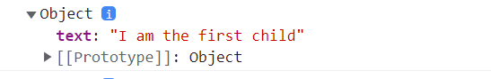
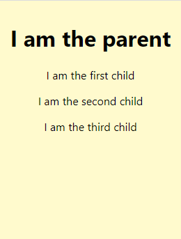

### Basics
- Parent component can pass data to its child component using the **props**. 
- Props are passed to component in function arguments.
- Props are JavaScript **objects** where keys are the prop names and the values are data you pass from a parent component to a child component.
- You can access props as an argument in the component function. For example, using the `props` keyword as shown in the following code snippet.
- You can display the value of the props by wrapping them inside curly brackets, for example `{props.firstname}` (= JSX, coming later).

```js
function HelloComponent(props) {
  return <div>Hello World {props.firstname}</div>;
}

const root = ReactDOM.createRoot(document.getElementById("root"));
root.render(<HelloComponent firstname="John" />);
```
- There can be multiple props passed to a component (multiple object properties):
```js
function HelloComponent(props) {
  return (
    <div>
      Hello World {props.firstname} {props.lastname}
    </div>
  );
}

const root = ReactDOM.createRoot(document.getElementById("root"));
root.render(<HelloComponent firstname="John" lastname="Smith" />);
```
- Or you can use object destructuring:
```js
// Destructing the props object --> {firstname, lastname}
function HelloComponent({ firstname, lastname }) {
  return (
    <div>
      Hello World {firstname} {lastname}
    </div>
  );
}
```
---
### PropTypes

- You can use `props` type checking in React by using the `PropTypes`.

```js
import PropTypes from "prop-types";

function HelloComponent(props) {
  return <div>Hello World {props.firstname}</div>;
}

HelloComponent.propTypes = {
  firstname: PropTypes.string, // string, number, bool, func etc.
};
```
- Note! This works only in development mode.
---
### Example of using props
Let's define two components. One of them (__parent__) renders the other (__child__) three times.
```js
function ParentComponent() {
  return (
    <div>
      <h1>I am the parent component</h1>
      <ChildComponent />
      <ChildComponent />
      <ChildComponent />
    </div>
  );
}

function ChildComponent() {
  return (
    <p>I am the first child</p>
  );
}
```
The output looks like the screenshot below:


- As expected, the program renders all children the same. They all think they are the first child.
- The children do not have the information about their position, only the parent knows it.
- The parent can convey this information to the children in __props__. 

### Passing props
- We can define our own attributes for components and give them JavaScript values at rendering. In React they are called _props_:
```jsx
  <ChildComponent attribute1={value1} attribute2={value2}>
```
- There can be any number of props. 
- You can use any name you like. It is the name of a variable.
- The value can be of any type: number, text, boolean, object, or function
- We can pass the text to show to the child component as an attribute. Let's call the attribute `text`:
```jsx
  <ChildComponent text={'I am the first Child'}>
```
### Receiving props
- React components are functions. Functions receive arguments in their parameters. 
- We need to define a parameter for the props. Let us also log the contents of the parameter to the console:
```javascript
  function ChildComponent(props) {
    console.log(props);
    return (<p>I am the first child</p>);
  }
```
- The console shows that `props` contains an object that has the attribute `text` as property:


### Using props

- Now the parent can tell the children what to show. The information is in `props`: 
```javascript
function ParentComponent() {
  return (
    <div>
      <h1>I am the parent</h1>
      <ChildComponent text={'I am the first child'} />
      <ChildComponent text={'I am the second child'} />
      <ChildComponent text={'I am the third child'} />
    </div>
  );
}

function ChildComponent(props) {
  return (<p>{props.text}</p>);
}
```
---
### Summary
- Why do you need props?
  - You need them whenever a parent component (one that renders other components) needs to pass information to the child it renders.
  - You can create reusable components using the props.

- How do `props` work?
  - Parent component can pass data to its child component usign the props.
  - The child receives `props` as argument (parameter value). The value of `props` in a JavaScript object with the attributes as properties. 
  Why are they called `props`?
  - `props`is short for _properties_. It is just a name of a function parameter. You could call it anything but by convention the parameter name is `props`.

### A tip for props
- You can simplify the usage of `props` by defining variables for the properties received, especially if there are several. Object destructuring syntax provides a nice shorthand notation:
```html
  <ChildComponent text={'I am child number'} position={pos} />
```

```javascript
  function ChildComponent(props) {
      //highlight-next-line
    const { text, position } = props;

    return (
      <p>{text} {position}</p>
    );
  }
```
OR

```javascript
  function ChildComponent({ text, position }) {
    return (
      <p>{text} {position}</p>
    );
  }
```

---
### Further reading

- https://itnext.io/what-is-props-and-how-to-use-it-in-react-da307f500da0
- https://javascript.info/destructuring-assignment#object-destructuring


