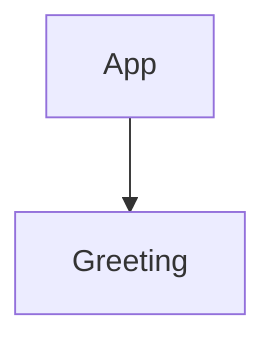
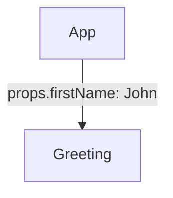
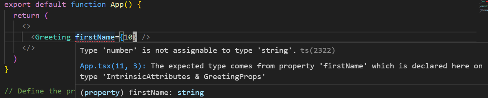
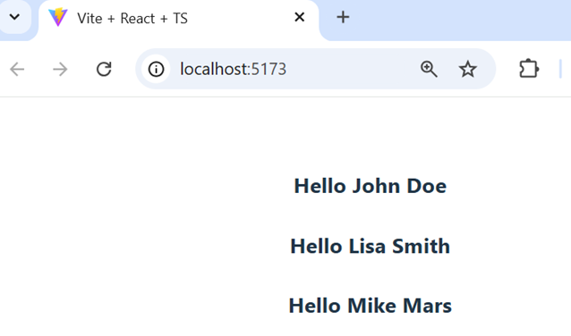
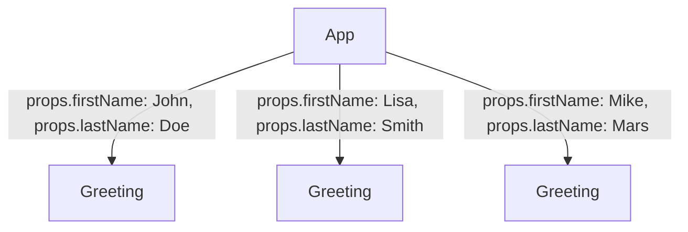
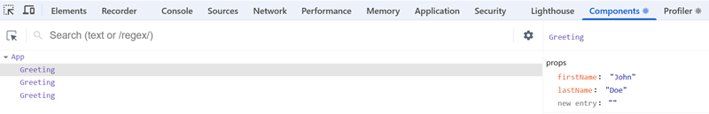

### Nested components

Nested components in React is the concept of one component being rendered inside another component. This creates a parent-child relationship, where the parent component includes and renders the child component.

In the following example, the `<Greeting />` tag inside the `App` component's return statement indicates that the `Greeting` component will be rendered as part of the App component's output. Nesting can be extended to multiple levels creating a component tree.

```jsx
// Parent component
export default function App() {
  return (
    <>
      <Greeting />
    </>
  )
}

// Child component
function Greeting() {
  return(
    <h4>Hello World!</h4>
  )
}
```
Here is how the component tree looks like:


By default, the data flows in only one direction in the component tree, from a parent component to a child component.

### Props
Parent component can pass data to its child component using the **props**. Props are passed to component in function arguments. Props are JavaScript **objects** where keys are the prop names and the values are data you pass from a parent component to a child component.

The `Greeting` component in the previous example was not very usable because it just show the static message "Hello World!". To make a child component more reusable we can use props.  This way, instead of creating multiple similar components with hardcoded values, you can use a single component and pass different props to it in different situations. 

```jsx
// Parent component
export default function App() {
  return (
    <>
      <Greeting firstName="John" />
    </>
  )
}

// Child component
function Greeting(props) {
  return(
    <h4>Hello {props.firstName}</h4>
  )
}
```
The component tree now looks like the following, and the first name is passed from the parent component to the child component using `props`:


Now, you will get an error because we are using TypeScript in our React project and props object type should be defined.

#### Typing props

In TypeScript, you define a `type` or an `interface` to describe the shape of the props object that a component expects. This `type` specifies the names and types of each prop. In the example, `GreetingProps` type defines that the `Greeting` component expects a prop named `firstName` of type `string`.

```tsx
export default function App() {
  return (
    <>
      <Greeting firstName="John" />
    </>
  )
}

// Define the props type
type GreetingProps = {
  firstName: string;
}

function Greeting({ firstName }: GreetingProps) {
  return(
    <h4>Hello {firstName}</h4>
  )
}
```
TypeScript will now perform type checking on the props passed to the `Greeting` component and you will get development time error when trying to pass a value with wrong type:



You can access props as an argument in the component function. For example, using the `props` keyword as shown in the previous example. You can display the value of the props by wrapping them inside curly brackets, for example `{props.firstName}` (= JSX, coming later).

```js
function Greeting(props: GreetingProps) {
  return(
    // highlight-next-line
    <h4>Hello {props.firstName}</h4>
  )
}
```
You can pass multiple props to a component (multiple object properties) like shown in the following example:
```jsx
export default function App() {
  return (
    <>
      <Greeting firstName="John" lastName="Doe"/>
    </>
  )
}

type GreetingProps = {
  firstName: string;
  lastName: string;
}

function Greeting(props: GreetingProps) {
  return(
    <h4>Hello {props.firstName} {props.lastName}</h4>
  )
}
```
The common way is to use object destructuring on the `props` object:
```js
// Destructing the props object --> {firstName, lastName}
function Greeting({ firstName, lastName }: GreetingProps) {
  return (
    <h4>Hello {firstName} {lastHame}</h4>
  );
}
```
### JSX
**JSX** is Javascript syntax extension which is recommended to use with React. In the example above, we had the following `return` statement, and it contains JSX that looks very similar to HTML.

```jsx
return (
  <h4>Hello {firstname} {lastname}</h4>
);
```
We can embed JavaScript expressions to JSX by wrapping them within the curly braces (`{}`). After compilation, JSX expressions becomes regular JavaScript objects.

More JSX examples:
```jsx live
function HelloComponent() {
  const name = "Mary";
  const age = 20;
  
  return (
    <>
      <p>Hello {name}</p>
      <p>Is {name} older than 18? {age > 18 ? 'Yes' : 'No'}</p>
      <p>3 + 5 equals {3 + 5}</p>
    </>
  );
}
```

You can display child component multiple times inside the parent component. Each child component is its own independent instance of `Greeting` component.

```tsx
type GreetingProps = {
  firstName: string;
  lastName: string;
}

export default function App() {
  return (
    <>
      <Greeting firstName="John" lastName="Doe"/>
      <Greeting firstName="Lisa" lastName="Smith"/>
      <Greeting firstName="Mike" lastName="Mars"/>
    </>
  )
}

function Greeting({firstName, lastName}: GreetingProps) {
  return(
    <h4>Hello {firstName} {lastName}</h4>
  )
}
```
In the following image, you can see how the `Greeting` component renders in the browser when different props are passed to it. Each instance of the `Greeting` component displays a personalized greeting message based on the `firstName` and `lastName` props provided.



Now, the component tree and data flow looks the following:

### Optional props
You can define optional props using the `?` syntax in TypeScript. This allows you to specify that a prop is not required and can be omitted when the component is used.

In the following example, the `lastName` prop is marked as optional in the `GreetingProps` type definition. This means that the `Greeting` component can be used with or without the `lastName` prop.

```tsx
export default function App() {
  return (
    <>
      <Greeting firstName="John" />
      <Greeting firstName="John" lastName="Doe" />
    </>
  )
}

type GreetingProps = {
  firstName: string;
  lastName?: string; // Optional props
}

function Greeting(props: GreetingProps) {
  return(
    <h4>Hello {props.firstName} {props.lastName}</h4>
  )
}
```
By using optional props, you can create more flexible and reusable components that can adapt to different use cases without requiring all props to be specified every time.

You can also pass functions using props. This is quite common scenario in React and we will use that later in this course.

The general syntax for defining a function type is:

```
(parameter1: type1, parameter2: type2, ...) => returnType
```
For example:
```tsx
 type MyComponentProps = {
  onAction: (id: number, name: string) => boolean;
  onClick?: () => void;
 }
```
The `onAction` is a required function that takes two parameters: `id` that is  a number and `name` that is  a string. The function returns a boolean value.
The `onClick` is an optional function that takes no parameters and returns nothing (`void`).

:::note[Type vs interface]
Both `type` and `interface` can be used to define the shape of props in TypeScript. The choice between them can depend on your specific use case. In this course we are mostly using `type`.

Here is an example using interface:
```tsx
interface HelloProps {
  name: string;
  age: number;
}

function Hello({ name, age }: HelloProps) {
  return (
    <div>
      Hello {name}, you are {age} years old!
    </div>
  )
}
```
Interfaces can be extended using the extends keyword, allowing for easy composition and reuse of types. Type can create union and intersection types, which can be very powerful for complex type definitions.
:::
### React Developer Tools
**React Developer Tools** is available as a browser extension for Chrome, Firefox, and Edge. It allows you to debug your React components.

Install the extension for your browser. Once installed, you'll find two new tabs in your browser's developer console: **Components** and **Profiler**

React Developer Tools components tab can be used to debug component's state and props values.

In the following image, you can see how our Greeting component example code looks in the React Developer Tools components tab. On the left-hand side, you can see the component tree, and by selecting a Greeting component in the component tree, you can inspect the value of the component's props.



### Summary
Why do you need props?
  - You need them whenever a parent component (one that renders other components) needs to pass information to the child it renders.
  - You can create reusable components using the props.

How do `props` work?
  - Parent component can pass data to its child component using the props.
  - The child receives `props` as argument (parameter value). The value of `props` is an object with the attributes as properties. 
  Why are they called `props`?
  - `props`is short for _properties_. It is just a name of a function parameter. You could call it anything but by convention the parameter name is `props`.
---
### Further reading
- https://react.dev/learn/passing-props-to-a-component
- https://react.dev/learn/react-developer-tools


