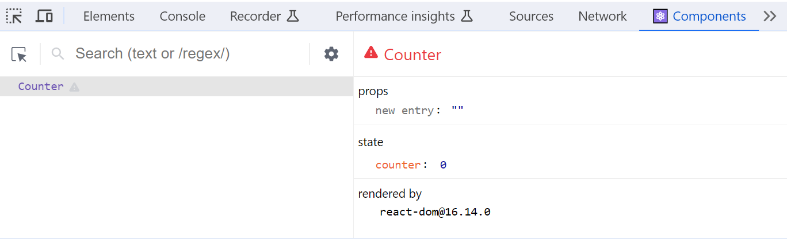

**State** is component specific "memory" and it triggers component re-render when its value is changed.

### Initializing state
- **State** is initialized using the **`useState`** hook function. In React, **hook** functions are named using the convention of starting the function name with **use** followed by a descriptive term that explains what the hook does (in this case "State"). 
- Example below creates state variable called `firstName` and function `setFirstName` is used to update its value.
- The `useState` takes one argument that is an initial value of the defined state.

```js
const [firstName, setFirstName] = React.useState("John");
```
### Updating state
- State value is **always** updated by using the function that you define in your `useState` hook (see the previous slide and the second element in the array). Now, in this case the function is `setFirstName`.

```js
// Update value of the state
setFirstName("Jim");
```

- State can be accessed by using name of a state (in this case `firstName`).

- **Do Not** update state directly!

:::danger
```js
firstName = "John";
```
:::
- **Always** use a function that is defined in the `useState` hook, then React knows when a state value has changed and re-rendering is needed.

---
### Counter example
- Next, we will create a counter app (screenshot below).
  
- We have one state and the value of the state is incremented by one when a user press the button.
- First, we have to declare state. The name of state is `count` and its value can be updated using the `setCount` function. The intial value is zero.

```js
function Counter() {
  const [count, setCount] = React.useState(0);
  // Continue...
```
- Then, in the `return` statement we will render the `count` state value and the button.
- Button's `onClick` event attribute invokes `setCount` function and increments the `count` state value by one. The component is re-rendered when the state changes and therefore you can see the new value in the screen.

```jsx
return (
  <div>
    <p>You clicked {count} times</p>
    <button onClick={() => setCount(count + 1)}>+</button>
  </div>
);
```

- Below is the source code of the `Counter` component:

```jsx live
function Counter() {
  const [count, setCount] = React.useState(0);

  return (
    <div>
      <p>You clicked {count} times</p>
      <button onClick={() => setCount(count + 1)}>+</button>
    </div>
  );
}
```
---
### Question
- Change the counter app and render `Counter` component three times. How counter values are changed if you click any of the buttons? Why?

```jsx
function Counters(){

  return (
    <div>
      <Counter />
      <Counter />
      <Counter />
    </div>
  );
}
```
---
:::note
State updates are asynchronous and batched. In the Counter example, the new state depends on the previous value of the state. To make sure that the state is always updated correctly, you should pass a function that updates the state like shown in the following example.

```jsx
return (
  <div>
    <p>You clicked {count} times</p>
    <button onClick={() => setCount((prevCount) => prevCount + 1)}>+</button>
  </div>
);
```
:::

### State batching
- State updates are batched to minimize re-renders for better performance.
- Before React 18 only state updates in the event handlers are batched.
- In React 18+ all updates are batched.

```jsx
// State batching
function App() {
  const [count, setCount] = useState(0);
  const [msg, setMsg] = useState("");

  function handleClick() {
    setCount((prevCount) => prevCount + 1); // Does not re-render yet
    setMsg("Counter: " + count); // Does not re-render yet
    // Now, React re-render
  }

  return (
    <div>
      <p>You clicked {count} times</p>
      <button onClick={handleClick}>Next</button>
    </div>
  );
}
```

- If you don't want to batch state updates, you can use `flushSync()` from `react-dom` package.

```jsx
import { flushSync } from 'react-dom';
...

function handleClick() {
  flushSync(() => {
    setCounter(prevCount => c + 1);
  });
  // DOM is updated
  flushSync(() => {
    setMsg('Counter: ' + count);
  });
  // DOM is updated
}
...
```
:::warning 
`flushSync` can have negative effect to performance. Use only when necessary.
:::
###  React Developer Tools
- **React Developer Tools** is available as Chrome plugin, Firefox add-on or Edge extension. That can be used to debug your components.
- Install this extension to your browser. After the successful installation you can see two new tabs in the browser console (Components and Profiler).
- React Developer Tools can be used to debug component's state and props values.



### Multiple states
- If you need to have multiple state variables, you can just call `useState` hook function multiple times.
```js
const [firstName, setFirstName] = React.useState("John");
const [lastName, setLastName] = React.useState("Johnson");
```
- Or you can use an object state. That is recommended if the values are related to each others. For example, you have to store information about user (first name, last name, address, email, etc.).

```js
const [name, setName] = React.useState({
  firstName: "John",
  lastName: "Johnson",
});
```
- If you use an object state, you can access state values by using the following syntax:

```js
state_name.property;

// for example
name.firstName;
```
- If you use an object state, you can update values by using the `setName` function and passing new object as parameter.

```js
setName({ firstName: "Jim", lastName: "Brown" });
```

- If only one value is updated, you have to use the object spread syntax (there is no auto merging) and pass new object as an argument to state update function (partial update).

```js
setName({ ...name, lastName: "Smith" });
// New value is now firstName: John, lastName: Smith
```
---
### When to use state?
- There are some differencies between states and variables that is good to understand. You should avoid unnecessary states. The more states a component has, the more complex its code becomes. It might also affect to performance.

Here are some key differences:

**State**
- The value of state persist between re-renders
- Component is re-rendered if state value changes.

**Variable**
- The value of variable doesn't persist between re-renders.
- Component is not re-rendered if variable value changes.

Variables can be used to data that doesn't impact component's output directly.

#### ref

If you need variable that persist between re-renders but it is not needed for rendering, you can use React `ref`. You can create a `ref` by calling the `useRef` hook function and pass initial value as an argument.

For example,
```js
const myRef = useRef(0) // Call useRef hook in the top level of your component
```

The `useRef` hook function returns an object with a single property: `current`. That property can be used to access and set a value.
```js
myRef.current = 10;
``` 

See the example in React documentation: https://react.dev/reference/react/useRef#examples-value

---
### React state (Extra material)

- `useReducer` hook function is alternative to `useState`
- It is recommended to use, when the next state depends on the previous state (like in the case of counter example) or you have complex state.
- `useReducer` accepts reducer function and initial state as arguments.

```js
const [state, dispatch] = React.useReducer(reducer, { count: 0 });
```

- State updates are done by using `reducer` function and it takes two arguments: previous state and action.
- The `reducer` function returns next state.
- The `reducer` is pure function (takes an input and returns an output without changing the input). In this case, it gets previous state as input and returns next state.

```js
(previousstate, action) => newstate;
```
- The following `reducer` function handles the increment and decrement of count state.

```js
function reducer(state, action) {
  switch (action.type) {
    case 'increment':
      return {count: state.count + 1
    case 'decrement':
      return {count: state.count - 1
    default:
      throw new Error();
   }
}
```
---
- The `reducer` function can be now called from the counter buttons in the following way:

```html
<button onClick={() => dispatch({type: 'decrement'})}>-</button>
<button onClick={() => dispatch({type: 'increment'})}>+</button>
```