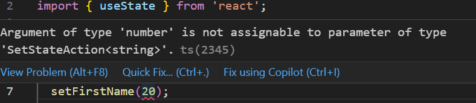
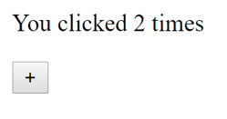
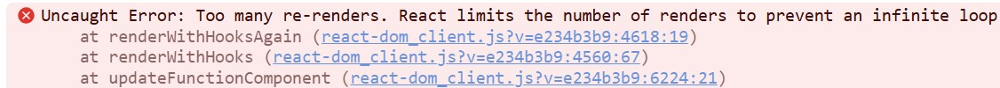
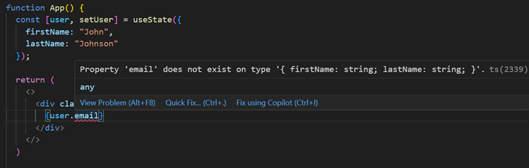

**State** is component specific "memory" and it triggers component re-render when its value is changed.

### Creating a state
**State** is created using the **`useState`** hook function. In React, **hook** functions are named using the convention of starting the function name with **use** followed by a descriptive term that explains what the hook does (in this case "State"). 

To use `useState`, you need to import it from the `react` library:
```js
import { useState } from 'react';
```
The following example creates the state variable named `firstName` and the function `setFirstName` is used to update state's value. The `useState` hook function takes one argument that is an initial value of the defined state.

```js
const [firstName, setFirstName] = useState("John");
```
Type inference works with the `useState` function. If you provide an initial value, TypeScript will automatically infer the type of the state. However, you can also explicitly define the type by passing a generic type argument to `useState`:
```ts
 const [firstName, setFirstName] = useState<string>("John");
```
In TypeScript, when creating a state with React's `useState` and the initial value is unknown, you can define the state using a union type that includes `undefined` or `null`. This allows you to initialize the state without a value while still maintaining type safety:
```ts
 const [firstName, setFirstName] = useState<string | undefined>();
```

### Updating state
State value is **always** updated by using the function that you define in your `useState` hook. Now, in this case the function is `setFirstName`.

```ts
// Update value of the state
setFirstName("Jim");
```

State can be accessed by using name of a state (in this case `firstName`).

**Do Not** update state directly!

:::danger
```js
firstName = "John";
```
:::

**Always** use a function that is defined in the `useState` hook, then React knows when a state value has changed and re-rendering is needed.

If you try to update the state with a value of an incorrect type, you will get development time TypeScript error. This is good because fixing errors in the development phase is much "cheaper" than fixing them in production:

```ts
setFirstName(20);
```


### Counter example
Next, we will create counter example that the Vite starter project's `App` component already contains. But we will create it from scratch to learn React state.



Open the Vite project's `App.tsx` file in the editor and remove all unnecessary code and your code will look like the following:
```tsx
import './App.css'

function App() {
  return (
    <>
    </>
  )
}

export default App
```
First, we import the `useState` function from the `react` package. Then, we call the `useState` function to create a state. We will name our state to `count` and initialize its value to zero (0).

```tsx
// highlight-next-line
import { useState } from 'react'
import './App.css'

function App() {
  // highlight-next-line
  const [count, setCount] = useState(0)

  return (
    <>
    </>
  )
}

export default App
```
Next, the button is displayed in the `return` statement and the button text displays the `count` state value:
```tsx
import { useState } from 'react'
import './App.css'

function App() {
  const [count, setCount] = useState(0)

  return (
    <>
      // highlight-start
      <button>
        count is {count}
      </button>
      // highlight-end
    </>
  )
}

export default App
```
Button's `onClick` event attribute invokes `setCount` function and increments the `count` state value by one. The component is re-rendered when the state updates and therefore you can see the new value in the screen.

```tsx
import { useState } from 'react'
import './App.css'

function App() {
  const [count, setCount] = useState(0)

  return (
    <>
      // highlight-next-line
      <button onClick={() => setCount(count + 1)}>+</button>
        count is {count}
      </button>
    </>
  )
}

export default App
```

:::info
When using `setCount` in the `onClick` handler, you need to pass a function to the `onClick` handler. 

If you are calling `setCount(count + 1)` directly within the `onClick`, it immediately tries to update the state. This causes the component to re-render, and during the re-render, the `onClick` is executed again, leading to an infinite loop. In this case, you will see the following error in the console:


:::

### State updates
State updates are **asynchronous** and **batched**. In the counter example, the new state depends on the previous value of the state. To make sure that the state is always updated correctly, you should pass a function that updates the state like shown in the following code:

```tsx
return (
  <>
    <button onClick={() => setCount((prevCount) => prevCount + 1)}>
      count is {count}
    </button>
  </>
);
```
This is special case when state depends on the current value. Most of the time you just pass a new value to state update function.

#### Question
Now that our `App` component includes the counter functionality, open the `main.tsx` file and render the `App` component three times. When you run the app, you will see three buttons displayed in the browser. What happens to the `count` values when you click any of the buttons, and why does this behavior occur?

```tsx title="main.tsx"
createRoot(document.getElementById('root')!).render(
  <StrictMode>
    <App />
    <App />
    <App />
  </StrictMode>,
)
```
<details>
  <summary>Answer</summary>

  Each button increase its own count value. In this case we create three `Counter` component instaces. State is local to a component instance on the screen. If you render the same component multpile times each copy will have completely isolated state. 
</details>

### State batching
State updates are batched to minimize re-renders for better performance. Before React 18 only state updates in the event handlers are batched. In React 18+ all updates are batched.

```tsx
// State batching
function App() {
  const [count, setCount] = React.useState(0);
  const [msg, setMsg] = React.useState("");

  function handleClick() {
    setCount((prevCount) => prevCount + 1); // Does not re-render yet
    setMsg("Counter: " + count); // Does not re-render yet
    // Now, React re-render
  }

  return (
    <div>
      <p>You clicked {count} times</p>
      <p>{msg}</p>
      <button onClick={handleClick}>+</button>
    </div>
  );
}
```
If you don't want to batch state updates, you can use `flushSync()` from `react-dom` package.

```jsx
import { flushSync } from 'react-dom';
...

function handleClick() {
  flushSync(() => {
    setCounter(prevCount => c + 1);
  });
  // DOM is updated
  flushSync(() => {
    setMsg('Counter: ' + count);
  });
  // DOM is updated
}
...
```
:::warning 
`flushSync` can have negative effect to performance. Use only when necessary.
:::

### Conditional rendering
Conditional rendering allows you to show or hide elements and components based on certain conditions. 

For example:
```jsx
if (iconurl) {
  return ;
} else {
  return <div>No image found</div>;
}
```
The example above renders the image element if the `iconurl` state is defined, otherwise it renders _No image found_ text.

You can also use ternary operator (`condition ? exprIfTrue : exprIfFalse`) and now, we can have only one `return` statement:
```jsx
return (
  iconurl ? 
   :
  <div>No image found</div>
);
```
### Complex states

#### objects
If you need to have multiple state variables, you can just call `useState` hook function multiple times.
```ts
const [firstName, setFirstName] = useState("John");
const [lastName, setLastName] = useState("Johnson");
```
Or you can use an object state. That is recommended if the values are related to each others. For example, you have to store information about user (first name, last name, address, email, etc.).

```ts
const [user, setUser] = useState({
  firstName: "John",
  lastName: "Johnson",
});
```
TypeScript can infer the object state type and it looks the following;
```ts
{
  firstName: string; 
  lastName: string;
}
```
If you use an object state, you can access state values by using the following syntax:
```ts
state_name.property;

// for example
user.firstName;
```
When you try to access property that doesn't exist in the type, you will get TypeScript error:



It is recommended to define explicit types for complex states. Explicit types make it easier to understand the structure and expected data types of your state objects. This improves code readability and maintainability.

```ts
type User = {
  firstName: string;
  lastName: string;
}
```
And then you can use type when declaring a state, In the following example `user` state can have value of either `null` or `User` type object:
```ts
const [user, setUser] = useState<User | null>(null);
```
Or you can intialize state to empty object using the following syntax:
```ts
const [user, setUser] = useState<User>({} as User);
```
You can also have optional properties in your object state when defining the type:
```ts
type User = {
  firstName: string;
  lastName: string;
  email?: string;
}
```
In our example, you can update values by using the `setUser` function and passing new object as parameter.
```ts
setUser({ firstName: "Jim", lastName: "Doe" });
```
When updating a single property within an object stored in React state, you must use the object spread syntax. React does not automatically merge updates to object state. The spread syntax (`...`) allows you to copy the existing properties of the object and then update only the property you want to change.
```ts
setUser({ ...name, lastName: "Doe" });
// New value is now firstName: John, lastName: Doe
```
The following code demonstrates how to manage object state in a React component using TypeScript. It defines a `User` type with `firstName` and `lastName` properties. The `useState` hook initializes the `user` state with a default object. The component displays a greeting based on the `firstName` and includes a button that updates the `firstName` property of the user state to 'John' using the object spread syntax.

```tsx
import { useState } from 'react';
import './App.css';

type User = {
  firstName: string;
  lastName: string;
}

export default function App() {
  const [user, setUser] = useState<User>({
    firstName: "",
    lastName: "Doe",
  });

  return (
    <>
      <p>
        { user?.firstName ? `Hello ${user.firstName}` : "Hello Guest" }
      </p>
      <button onClick={() => setUser({...user, firstName: "John"})}>
        Update name
      </button>
    </>
  )
}
```

You can test the example in: https://codesandbox.io/p/sandbox/object-state-example-dtqdks

TypeScript types can represent nested objects, such as a user's address. You can define the nested object directly within the `User` type:
```ts
type User = {
  firstName: string;
  lastName: string;
  address: {
    streetAddress: string;
    houseNumber: number;
    postalCode: number;
  }
}
```
In this case, the better way is to create separate type for the `address`.  It improves readability and allows you to reuse the `Address` type elsewhere. 
```ts
type Address = {
  streetAddress: string;
  houseNumber: number;
  postalCode: number;
}

type User = {
  firstName: string;
  lastName: string;
  address: Address;
};
```

#### arrays
When initializing state with an array, TypeScript can often infer the array's type. F
```ts
// TypeScript infers number[]
const [numbers, setNumbers] = useState([1, 2, 3, 4, 5]);
```
In this case, TypeScript infers that numbers is of type `number[]`. However, with more complex types it's often good to explicitly define the type using the `useState` hook's generic type parameter:
```ts
// Explicitly typed as number[]
const [numbers, setNumbers] = useState<number[]>([1, 2, 3, 4, 5]); 
```

Array of user objects
```ts
type User = {
  firstName: string;
  lastName: string;
  email?: string;
}

type UserList = {
  users: User[];
}

const [users, setUsers] = useState<UserList | undefined>();
```
The intial value of `users` state is undefined because we don't set any intial value when calling `useState` hook function.

#### unions
In some cases, your state should be restricted to a specific set of values. You can use a union type to ensure that the state only accepts these predefined values:

```ts
type Status = "idle" | "pending" | "success" | "error";

const [status, setStatus] = useState<Status>("idle");
```
### When to use state?
There are some differencies between states and variables that is good to understand. You should avoid unnecessary states. The more states a component has, the more complex its code becomes. It might also affect to performance.

Here are some key differences:

**State**
- The value of state persists between re-renders
- Component is re-rendered if state value changes.

**Variable**
- The value of variable doesn't persist between re-renders.
- Component is not re-rendered if variable value changes.

Variables can be used to data that doesn't impact component's output directly.

### ref
If you need variable that persists between re-renders but it is not needed for rendering, you can use React `ref`. You can create a `ref` by calling the `useRef` hook function and pass initial value as an argument.

For example,
```js
// Call useRef hook in the top level of your component
const myRef = useRef<number>(0) 
```
The `useRef` hook function returns an object with a single property: `current`. That property can be used to access and set a value.
```js
myRef.current = 10;
``` 
See the example in React documentation: https://react.dev/reference/react/useRef#examples-value

### Extra material

The `useReducer` hook function is alternative to `useState` It is recommended to use, when the next state depends on the previous state (like in the case of counter example) or you have complex state. 

Read more about `useReducer` in https://react.dev/reference/react/useReducer.

---
### Further reading
- https://react.dev/learn/state-a-components-memory
- https://react-typescript-cheatsheet.netlify.app/docs/basic/getting-started/hooks#usestate
-  https://react.dev/learn/conditional-rendering
