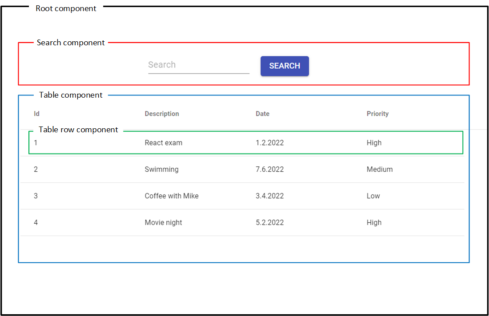
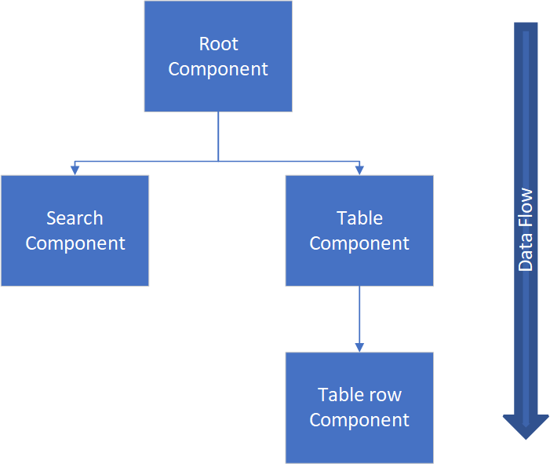

- JavaScript library for building user interfaces.
- Uses declarative way to define the UI and its changes.
- Developed by Meta (formerly Facebook) under the MIT license.
- React is component based and components are reusable. React components are JavaScript functions.
- React documentation: https://react.dev/

React components are like lego blocks from which you can build a user interface. The following UI example consists of three react components:
- Search component (red)
- Table component (blue)
- Table row component (green)

React components build a component tree that now looks the following. **Note!** By default, data only flows in one direction i.e. from top to bottom in the component tree.

### Virtual DOM
The **Document Object Model (DOM)** is an interface for the web document so that scripting languages, such as JavaScript, can access, manipulate, and programmatically interact with the document’s content. DOM manipulations in web applications are one of the most time consuming operations. React is using **virtual DOM**, that is a lightweight JavaScript presentation of the DOM. It is much faster to update the virtual DOM than the actual DOM. When the UI is changed, React creates a new virtual DOM and compares it to the previous one to find out what changes are necessary to the actual DOM. 
