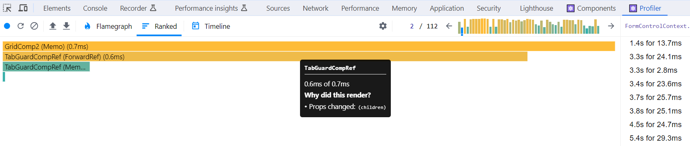

### Profiler

React Developer Tools provides **Profiler** that helps identify parts of an application that are slow. Open the browser console and open Profiler panel. Initially  the Profiler panel is empty and you can start new session by pressing the Record button. Then you use your React app as you normally would. When you are ready, press the Stop button.

The React profiler show **commits**  that are made in your React app. The commit is the moment when React applies changes to the DOM. In the each commit you can see what components were rendered and the time it takes. If you hover over the component, you can also see why the component was rendered.



Read more about Profiler in https://legacy.reactjs.org/blog/2018/09/10/introducing-the-react-profiler.html.

React also provides `Profiler` component that can be used programmatically analyze you React app' sperformance (https://react.dev/reference/react/Profiler)


### Excessive re-renders
- It is good to undestand that when component re-renders all of its child components also re-renders and in some cases this might be potential performance issue.
- Let's see one practical example:

```jsx
const ParentComponent = () => {
  const [text, setTeXt] = useState("");

  return (
    <div>
      <Input value={text} onChange={e => setText(e.target.value)}>
      <ChildComponent />
    </div>
  );
};
```
- `ChildComponent` looks the following.
```jsx
const ChildComponent = () => {
  console.log('Child is re-rendered');
  return <p>Child</p>;
};
```
- Now, each time when you type something to the `input` element, `ChildComponent` also re-renders and we can see 'Child is re-rendered' text in the console.
- What if there is some time consuming operation in the `ChildComponent` like in the following example code?
```JSX
const ChildComponent = () => {
  let now = performance.now();
  while (performance.now() - now < 1000) {
    // do nothing for 1000ms
  }
  return <p>Child</p>;
}
```
- Solution to this problem is so called 'Lifting content up';
```jsx
export default function App() {
  return (
    <ParentComponent>
      <ChildComponent />
    </ParentComponent>
  );
}

const ParentComponent = ({children}) => {
  const [text, setTeXt] = useState("");

  return (
    <div>
      <Input value={text} onChange={e => setText(e.target.value)}>
      {children}
    </div>
  );
};

const ChildComponent = () => {
  let now = performance.now();
  while (performance.now() - now < 1000) {
    // do nothing for 1000ms
  }
  return <p>Child</p>;
}
```
- Now, we pass the `ChildComponent` to the `ParentComponent` using `props`. When `text` state changes, the `ParentComponent` is re-rendered. But the `props` is not changed; therefore, `ChildComponent` is not re-rendered.


