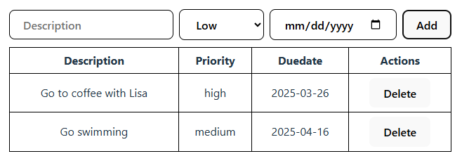
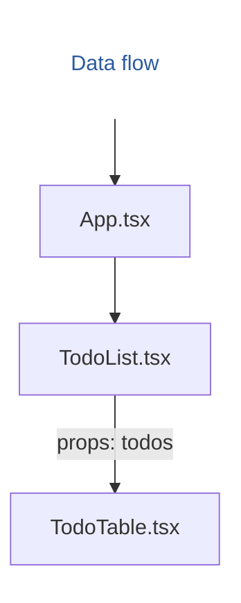
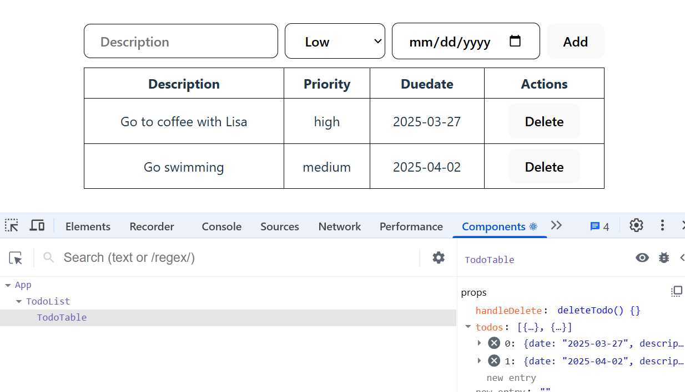

Let's refactor the todolist example application by breaking it into multiple components.  
:::note 
In this part, we  use the todolist, which also includes a date field. You should Add `Due date` to your todolist.

:::
We will add a new stateless component called `TodoTable` and separate it from the `TodoList` component. After splitting the components, our component tree is the following:


React data flow is **one-way**, from **top to bottom**, in the component tree.

The `TodoTable` component will be a child component of the `TodoList` component. Therefore, we can send data from the `TodoList` component to the `TodoTable` component by using the `props`.

Add a new file called `TodoTable.tsx` into the `src` folder. The starter code of the `TodoTable` component is shown below:
```tsx title="TodoTable.tsx"
function TodoTable(props) {
  return <></>;
}

export default TodoTable;
```
We need to define the type for the `props`, which contains an array of `todo` objects and delete function. Therefore, we define a new type called `TodoTableProps`.

```tsx title="TodoTable.tsx"
type Todo = {
  description: string;
  priority: 'low' | 'medium' | 'high';
  date: string;
}

type TodoTableProps = {
  todos: Todo[];
  handleDelete: (row: number) => void;
}

function TodoTable(props: TodoTableProps) {
  return(
    <></>
  );
}

export default TodoTable;
```
You will notice that we have defined the same `Todo` type in two files. Instead of doing that, it is better to create a separate file for defining types and then import these into the files where they are needed. Create a new file called `types.ts` in the `src` folder and define the types there.

```ts title="types.ts"
export type Todo = {
  description: string;
  priority: 'low' | 'medium' | 'high';
  date: string;
}

export type TodoTableProps = {
  todos: Todo[];
  handleDelete: (row: number) => void;
}
```
Then, we import the type into the `TodoTable` component where they are needed.
```tsx title="TodoTable.tsx"
import type { TodoTableProps } from './types';

function TodoTable(props: TodoTableProps) {
  return (
    <></>
  );
}

export default TodoTable;
```
Now, you can also remove `Todo` type definition in the `TodoList` component and import it from the `types.ts` file.

:::note[Type-only imports] 
You might notice that we use the `type` keyword when importing types.
```ts
import type { TodoTableProps, Todo } from './types';
```
This is so called **type-only imports**. This tells TypeScript explicitly that `TodoTableProps` is a type that should only be used at compile time and not included in the runtime JavaScript output.

In Vite's TypeScript configuration is the setting `verbatimModuleSyntax: true` which requires type-only imports for types.
:::

Next, we render table in the `TodoTable` component.
```tsx title="TodoTable.tsx"
import type { TodoTableProps, Todo } from './types'

function TodoTable(props: TodoTableProps) {
  return(
    <table>
      <thead>
        <tr>
          <th>Description</th>
          <th>Priority</th>
          <th>Duedate</th>
          <th>Actions</th>
        </tr>
      </thead>
      <tbody>
        {props.todos.map((todo: Todo, index: number) => (
          <tr key={index}>
            <td>{todo.description}</td>
            <td>{todo.priority}</td>
            <td>{todo.date}</td>
            <td>
              <button onClick={() => props.handleDelete(index)}>Delete</button> 
            </td>
          </tr>
        ))}
      </tbody>
    </table>     
  )
}

export default TodoTable;
```
:::info
The `TodoTable` component will be a **stateless component**. The stateless components are easy to test because they are pure functions. They are also simple to understand because they are just functions that takes props as input and returns JSX.
:::

Finally, import the `TodoTable` component into the `TodoList` component.
```js title="TodoList.tsx"
import TodoTable from './TodoTable';
```
Replace the HTML `table` element in the `TodoList` component's `return` statement with the `TodoTable` component. Pass the `todos` state and the `handleDelete` function as props to the `TodoTable` component.
```jsx title="TodoList.tsx"
return(
  <>
    <h3>My Todos</h3>
    <input 
      placeholder="Description" 
      onChange={event => setTodo({...todo, description: event.target.value})} 
      value={todo.description} 
    />
    <select
      title="Priority"
      onChange={event => setTodo({...todo, priority: event.target.value as 'low' | 'medium' | 'high'})} 
      value={todo.priority} 
    >
      <option value="low">Low</option>
      <option value="medium">Medium</option>
      <option value="high">High</option>
    </select>
    <button onClick={addTodo}>Add</button>
    //highlight-next-line
    <TodoTable todos={todos} handleDelete={deleteTodo} />
  </>
);
```
Now, the todolist app works as previously. If you open the React Developer tools, you can see new component tree structure.



We have now finalized out todo list app and in the next section we learn how to use third-party components and libraries.