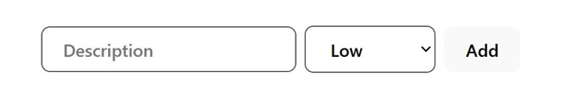
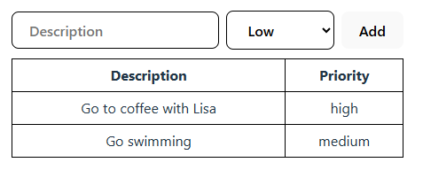

### Create Todolist project
We will create a simple todolist app where the user enters tasks and all tasks are listed in a table.

Create a new React App using **Vite** (Select React and JavaScript).

```bash
npm create vite@latest
```
Create a new file called **TodoList.tsx** inside the **src** folder. Add the following code into the file:
```jsx title="TodoList.tsx"
function TodoList() {
  return(
    <>
      <h3>My Todos</h3>
    </>
  );
}

export default TodoList;
```
At the beginning, the todo item has two fields: `description` and `priority`. We need one state for the todo item and one array state to store all todos. Let's declare states using the `useState` hook function but first, we have to declare type for our todo item. The `type Todo` in TypeScript is used to define the shape of the `Todo` object.
```tsx
type Todo = {
  description: string;
  priority: string;
}

function TodoList() {
  return(
    <>
      <h3>My Todos</h3>
    </>
  );
}

export default TodoList;
```
The accepted values for the priority are: 'low', 'medium' or 'high'. Therefore, we use a string literal union type to restrict the priority field to only accept specific values:
```tsx
type Todo = {
  description: string;
  // highlight-next-line
  priority: 'low' | 'medium' | 'high';
}

function TodoList() {
  return(
    <>
      <h3>My Todos</h3>
    </>
  );
}

export default TodoList;
```
Remove all unnecessary code from `App.tsx` and render the `TodoList` component:
```tsx title="App.tsx"
import TodoList from './TodoList'
import './App.css'

function App() {
  return (
    <>
      <TodoList />
    </>
  )
}

export default App
```
Now, we can declare states in our `TodoList` component::
```tsx title="TodoList.tsx"
// highlight-next-line
import { useState } from 'react';

type Todo = {
  description: string;
  priority: 'low' | 'medium' | 'high';
}

function TodoList() {
  // highlight-start 
  const [todo, setTodo] = useState<Todo>({description: '', priority: 'low'});
  const [todos, setTodos] = useState<Todo[]>([]);
  // highlight-end

  return(
    <>
      <h3>My Todos</h3>    
    </>
  );
}

export default TodoList;
```
The type of `todo` is `Todo` object. It is initialized with an object that has two properties: `description` (an empty string) and `priority` (set to `low`). If you try to set the `priority` field to a value that is not one of the defined string literals (`low`, `medium`, or `high`), TypeScript will raise a type error during development. 

The type of `todos` is an array of `Todo` objects (`Todo[]`), where `Todo` is an type that defines the shape of a `todo` item.

Next, we render the necessary elements to gather information and call the function that adds a new todo:
```tsx title="TodoList.tsx"
  const addTodo = () => {
    setTodos([todo, ...todos]);
  };
  
  return(
    <>
      <h3>My Todos</h3>
      <input 
        placeholder="Description" 
        onChange={event => setTodo({...todo, description: event.target.value})} 
        value={todo.description} 
      />
      <input 
        placeholder="Priority" 
        onChange={event => setTodo({...todo, priority: event.target.value})} 
        value={todo.priority} 
      />
      <button onClick={addTodo}>Add</button>    
    </>
  );
```
The `addTodo` function adds a new todo object to the `todos` array state. We use spread notation (`…`) to add a new item at the beginning of the existing array.

Now, you can see TypeScript error in the `priority` input field. The TypeScript error occurs because `event.target.value` returns a `string`, but the `priority` field requires the specific values `low`, `medium`, or `high`. We can solve this issue by using `select` element. 
```tsx title="TodoList.tsx"
  const addTodo = () => {
    setTodos([...todos, todo]);
  };
  
  return(
    <>
      <h3>My Todos</h3>
      <input 
        placeholder="Description" 
        onChange={event => setTodo({...todo, description: event.target.value})} 
        value={todo.description} 
      />
      <select
        title="Priority"
        onChange={event => setTodo({...todo, priority: event.target.value as 'low' | 'medium' | 'high'})} 
        value={todo.priority} 
      >
        <option value="low">Low</option>
        <option value="medium">Medium</option>
        <option value="high">High</option>
      </select>
      <button onClick={addTodo}>Add</button>    
    </>
  );
}
```
The `as` keyword is used here for type assertion. The `event.target.value` is of type `string`, but TypeScript doesn't know that the value will always be one of the specific strings `low`, `medium`, or `high`. By using `as 'low' | 'medium' | 'high'`, you are telling TypeScript that you know the value will be one of these specific strings, which matches the type definition of priority.

The `onChange` handler updates the `todo` state with the typed value. The `event` type is inferred automatically by the TypeScript compiler, so it is not explicitly required.

When creating a separate function to handle input data, you need to define the type of the function parameter, as demonstrated in the following example:
```tsx title="TodoList.tsx"
const handleChange = (event: React.ChangeEvent<HTMLInputElement>) => {
    setTodo({ description: event.target.value });
};
```
The `event` is typed as `ChangeEvent<HTMLInputElement>`, indicating that this function handles change events from an HTML input element.

#### Styling
Styles are defined in the `App.css` and `index.css` files. These are Vite's default styles, and you can use your own instead.

For example, the button style can be found in the index.css file
```css title="index.css"
button {
  border-radius: 8px;
  border: 1px solid transparent;
  padding: 0.6em 1.2em;
  font-size: 1em;
  font-weight: 500;
  font-family: inherit;
  background-color: #1a1a1a;
  cursor: pointer;
  transition: border-color 0.25s;
}
```
You can add similar styling for the `input` and `select` elements by adding the following styling:
```css title="index.css"
input, select {
  border-radius: 8px;
  border: 1px solid;
  padding: 0.6em 1.2em;
  font-size: 1em;
  font-weight: 500;
  font-family: inherit;
  background-color: 'white';
  transition: border-color 0.25s;
  margin-right: 8px;
}
```
Now, your todolist UI should look as following image:



### Display todos
First, it is good to learn JavaScript function that is really useful with arrays. The `map()` function creates a new array with the results of calling a function for every array element. The following code example demonstrates the usage:
```js
let arrA = [1, 2, 3]
let arrB = arrA.map((x) => x * 2)
// arrB = [2, 4, 6]
```
The `map` statement above returns a new array with values multiplied by 2. The `map()` function can be used to display items of the array state.

Next, we add the `table` element to the `return` statement and display all todos inside the table using the `map()` function.
```tsx title="TodoList.tsx"
return (
  <>
    <h3>My Todos</h3>
    <input 
      placeholder="Description" 
      onChange={event => setTodo({...todo, description: event.target.value})} 
      value={todo.description} 
    />
    <select
      title="Priority"
      onChange={event => setTodo({...todo, priority: event.target.value as 'low' | 'medium' | 'high'})} 
      value={todo.priority} 
    >
      <option value="low">Low</option>
      <option value="medium">Medium</option>
      <option value="high">High</option>
    </select>
    <button onClick={addTodo}>Add</button>      
    //highlight-start
      <table>
        <thead>
          <tr>
            <th>Description</th>
            <th>Priority</th>
          </tr>
        </thead>
        <tbody>
          {todos.map((todo, index) => (
            <tr key={index}>
              <td>{todo.description}</td>
              <td>{todo.priority}</td>
            </tr>
          ))}
        </tbody>
      </table>     
    //highlight-end
  </>
);

export default TodoList;
```
The `key` string attribute is needed in the lists. That helps React to identify which rows have changed. The `map()` has a second argument, that is running index and we use that in our table rows.

:::warning
The use of index is not recommended in proper apps because it can cause bugs if a list is reordered or you add or delete list items. Instead of that, you should use a unique key from the data if it exists. There are also libraries available that you can use to generate unique IDs, such as uuid (https://github.com/uuidjs/uuid). We will use that later in our todo list app.
:::

Finally, the complete `TodoList.tsx` source code looks the following:
```tsx title="TodoList.tsx"
import { useState } from 'react';

type Todo = {
  description: string;
  priority: 'low' | 'medium' | 'high';
}

function TodoList() {
  const [todo, setTodo] = useState<Todo>({description: '', priority: 'low'});
  const [todos, setTodos] = useState<Todo[]>([]);
  
  const addTodo = () => {
    setTodos([...todos, todo]);
  };

  return(
    <>
      <h3>My Todos</h3>
      <input 
        placeholder="Description" 
        onChange={event => setTodo({...todo, description: event.target.value})} 
        value={todo.description} 
      />
      <select
        title="Priority"
        onChange={event => setTodo({...todo, priority: event.target.value as 'low' | 'medium' | 'high'})} 
        value={todo.priority} 
      >
        <option value="low">Low</option>
        <option value="medium">Medium</option>
        <option value="high">High</option>
      </select>
      <button onClick={addTodo}>Add</button>
      <table>
        <thead>
          <tr>
            <th>Description</th>
            <th>Priority</th>
          </tr>
        </thead>
        <tbody>
          {todos.map((todo, index) => (
            <tr key={index}>
              <td>{todo.description}</td>
              <td>{todo.priority}</td>
            </tr>
          ))}
        </tbody>
      </table>     
    </>
  );
}

export default TodoList;
```
Now, you can run the project using the following npm command:
```bash
npm run dev
```
Add some todos and see that they are displayed in the table. 

#### Styling
The todolist is currently centered on the screen due to the body style setting `place-items: center;`. To move the todolist to the top of the screen, change this value to `flex-start` in the `index.css` file.

You can also add some styling to your table. For example, add the following styling to the `App.css` file:
```css
table {
  width: 100%;
  border-collapse: collapse;
  margin-top: 10px;
}

table th,
table td {
  border: 1px solid black;
  padding: 6px; 
}
```
Now, your todolist should look the following:



:::info[TASKS]
Implement the following features to your Todolist app:
1. Clear the input element after the Add button is pressed.
2. Add validation that an `alert` is shown if the `description` value is empty when new todo is added.
:::

Next, we will refactor our todo list app and split table to own stateless component.

