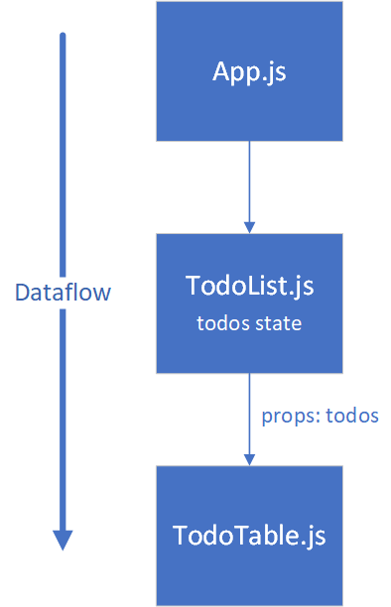

- Create a new React App using **Vite**
- Create a new file called **_TodoList.jsx_** inside the **_src_** folder.
- The todo item has one description field called `desc`.
- We need one state for the description and one array state for all todos. Let’s declare states using the `useState` hook function.

```js
// Import useState from react
import { useState } from "react";

// Declare states
const [desc, setDesc] = useState("");
const [todos, setTodos] = useState([]);
```
- The `input` element is used to collect data from a user
- The `addTodo` function is invoked when the button is pressed

```jsx
// The return statement
<input type="text" onChange={inputChanged} value={desc} />
<button onClick={addTodo}>Add</button>
```
- The `addTodo` function adds a new todo item to the `todos` array state. We use spread notation (`…`) to add a new item at the end of the existing array.

```jsx
const inputChanged = (event) => {
  setDesc(event.target.value);
};

// Remember to call preventDefault() if using form
const addTodo = () => {
  setTodos([...todos, desc]);
};
```
- Next, we add the `table` element to the `return` statement and render all todos inside the table using the `map()` function.

```jsx
return (
  <>
    <input type="text" onChange={inputChanged} value={desc} />
    <button onClick={addTodo}>Add</button>
    <table>
      <tbody>
        {todos.map((todo, index) => (
          <tr key={index}>
            <td>{todo}</td>
          </tr>
        ))}
      </tbody>
    </table>
  </>
);
```
- You also have to export the **Todolist** component.

```js
export default Todolist;
```
- Finally, we render the `TodoList` component inside the **_App.jsx_** `return` statement

```jsx
// App.jsx
import "./App.css";
import TodoList from "./TodoList";

function App() {
  return (
    <div className="App">
      <TodoList />
    </div>
  );
}

export default App;
```

---
### Styling

- Styles are defined in the App.css and index.css files.
- These are Vite's default styles, and you can use your own instead.
- For example, the button style can be found in the index.css file

```css
button {
  border-radius: 8px;
  border: 1px solid transparent;
  padding: 0.6em 1.2em;
  font-size: 1em;
  font-weight: 500;
  font-family: inherit;
  background-color: #1a1a1a;
  cursor: pointer;
  transition: border-color 0.25s;
}
```
---


- See the source code (TodoList.js) http://bit.ly/2wyoBkx


---
## Split components
- Let’s split todolist example application into multiple components.
- We will add a new stateless component called `TodoTable` and separate it from the `TodoList` component.
- Add a new file called **TodoTable.jsx** into the **src** folder. The skeleton code of the component is shown below. Note! It will be a stateless component.

```jsx
import React from "react";

function TodoTable(props) {
  return <></>;
}

export default TodoTable;
```

- The `TodoTable` component will be a child component of the `TodoList` component. Therefore, we can send data from the `TodoList` to `TodoTable` component by using the props (see the next slide).

```jsx
return (
  <>
    <table>
      <tbody>
        <tr>
          <th>Date</th>
          <th>Description</th>
        </tr>
        {props.todos.map((item, index) => (
          <tr key={index}>
            <td>{item.date}</td>
            <td>{item.description}</td>
          </tr>
        ))}
      </tbody>
    </table>
  </>
);
```

In this phase, our React app's component tree is the following:



- React dataflow is one-way from top to bottom in the component tree.
- You can use **props** to pass data from a parent to a child.

- Finally, import the `TodoTable` component into `TodoList` component (modify the TodoList.js file).

```js
import TodoTable from "./TodoTable";
```

- Remove the HTML table element from the `TodoList` component's `return` statement and add the `TodoTable` component there. Now, we will pass todos to the `TodoList` component by using `props`.

```js
<TodoTable todos={todos} />
```

---
### Vite - ESLint

- Linters in programming are tools designed to analyze source code and identify potential issues, coding style violations, and error
- **ESLint** is popular linter for JavaScript and TypeScript. Vite is using ESLint by default.
- You can find the ESLint configuration file `.eslintrc.cjs` from the root folder of your Vite project.
- You can define ESLint rules in this file to specify coding standards and guidelines for your project. 
- You might have seen that ESLint is giving a warning about missing `PropTypes`. We introduced PropTypes at the beginning of the course, but we haven't used them. React recommends using TypeScript instead of checking prop types at runtime.  

- You can exclude PropTypes check by adding the following line in your `.eslintrc.cjs` file:
```js
module.exports = {
  root: true,
  env: { browser: true, es2020: true },
  extends: [
    'eslint:recommended',
    'plugin:react/recommended',
    'plugin:react/jsx-runtime',
    'plugin:react-hooks/recommended',
  ],
  ignorePatterns: ['dist', '.eslintrc.cjs'],
  parserOptions: { ecmaVersion: 'latest', sourceType: 'module' },
  settings: { react: { version: '18.2' } },
  plugins: ['react-refresh'],
  rules: {
    'react-refresh/only-export-components': [
      'warn',
      { allowConstantExport: true },
    ],
    'react/prop-types': 0  // ADD THIS LINE 
  },
}
```
