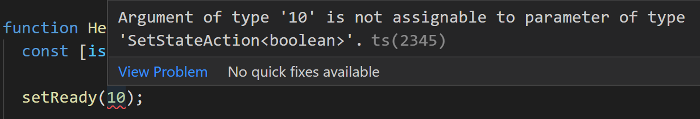

### TypeScript - Basics

- TypeScript is strongly typed programming language (https://www.typescriptlang.org/) that is based on JavaScript.
- Benefits of using TypeScript:
  - Catch errors before pushing your code to production.
  - Code is easier to understand and refactor/maintain.
  - Provides more information to developer (Self documented)
  - More popular nowadays (Great skill)
- You can try TypeScript in your browser: https://www.typescriptlang.org/play
- You can install TypeScript into your project using the npm:

```bash
npm install typescript --save-dev
```

- Then you can run TypeScript compiler using the following command:

```bash
npx tsc
```

- You can also install TypeScript globally and then `tsc` command is available in all locations in your terminal.
- VSCode provides nice features for TS development. Read mode here: https://code.visualstudio.com/docs/languages/typescript

#### Type inference

- TypeScript will automatically define the type when you initialize a variable. In the following example, we declare variable `helloworld` and assign it to a string value. If we try to re-assign it with other type, we get an error.


- The most common primitive types are: `string`, `number` and `boolean`
- See the different types: https://www.typescriptlang.org/docs/handbook/2/everyday-types.html

---

- You can also set explicit type to a variable:

```ts
let name: string
let age: number
```

- You can check the type using the `typeof`:

```ts
typeof name === "string" // true
typeof age === "number" // true
```

- If the type is not known when you write code, you can use `unknown` type.

```ts
let a: unknown = 10
a = "It should be string"
```

- If you want to exlude type checking, you can use `any` type.

```ts
let a: any = 10
```

- The `unknown` type is a safer alternative to `any`. It represents any value, but you cannot perform operations on it without first asserting its type. The code below demonstrates the difference between `any` and `unknown`.

Using `unknown`:

```ts
let value: unknown

value = 42 // This is OK
value = "hello" // This is OK
value = true // This is OK

// Type checking is required before using the value
if (typeof value === "number") {
  let num: number = value
}
```

Using `any`:

```ts
let value: any

value = 42 // This is OK
value = "hello" // This is OK
value = true // This is OK

// Type checking is not required
// This is OK, but potentially unsafe
let num: number = value
```

#### Functions

- You can define the type of parameters and return value

```ts
function calc(x: number, y: number): number {
  return x * y
}
```

- In JavaScript function parameters are optional by default.
- In TypeScript, you will get an error if you don't pass all function parameters. To make function parameter optional, you can use `?` after the parameter name.

```ts
function sayHello(name: string, age?: number): string {
  if (!age) return `Hello ${name}`

  return `Hello ${name}, you are ${age} year(s) old`
}
```

- Now, you can call function in the following ways:

```ts
sayHello("John")
// or
sayHello("John", 20)
```

- If there is no return value, you can use the `void` keyword:

```ts
function logMessage(message: string): void {
  console.log(message)
}
```

#### Arrays

- Arrays are declared with the following syntax:

```ts
const arr: type[]
```

- For example:

```ts
let names: string[]
names = ["John", "Lisa", "Mike"]

// You can also use Array() constructor
let nums: number[] = new Array(10)
nums[0] = 4
```

- You can also combibe more complex types
- Unions:

```ts
type MyStates = "awake" | "sleep" | "eating"
```

- Generics:

```ts
type NumArray = Array<number>
```

#### Structural types

- Structural types (define entities) are used a lot with React. For example, typing component props.
- You can use `interface` or `type` keyword.

```ts
interface Person {
  name: string
  age: number
}

type Point = {
  x: number
  y: number
}
```

- See the difference between types and interfaces: https://www.typescriptlang.org/docs/handbook/2/everyday-types.html#differences-between-type-aliases-and-interfaces

---

- If you have nested objects in your entities, for example:

```ts
interface Person {
  name: string
  age: number
  address: {
    street: string
    number: number
    zip: number
  }
}
```

- Instead of using nested object, you can create `Address` interface

```ts
interface Address {
  street: string
  number: number
  zip: number
}

interface Person {
  name: string
  age: number
  address: Address
}
```

---

### React & TypeScript

- You can use TypeScript in your Vite React project by selecting **TypeScript** variant when creating a Vite project:

```
npm create vite@latest
```

- React provides `@types/react` and `@types/react-dom` packages that offer useful types for React. If you create Vite project using TypeScript, these packages are installed as development dependencies. There is also a configuration file `tsconfig.app.json` created in the Vite project for TypeScript, and it specifies the compiler options required to compile the project.

---

#### Component props

- You can define the type for the function component `props` (=function arguments)

```tsx
interface HelloProps {
  name: string
  age: number
}

function Hello({ name, age }: HelloProps) {
  return (
    <div>
      Hello {name}, you are {age} years old!
    </div>
  )
}

export default Hello
```

- Now, if you pass value that doesn't match to defined type, you will get an error.


- You can define optional props using the `?`, for example:

```tsx
interface HelloProps {
  name: string
  age?: number
}

function Hello({ name, age }: HelloProps) {
  return (
    <div>
      Hello {name}
      {age && <>, you are {age} years old!</>}
    </div>
  )
}

export default Hello
```

- If the props value is a function, the definition is following:

```ts
interface HelloProps {
  name: string
  age?: number
  myFunc: () => void // no parmeters and return value
}
```

```ts
interface HelloProps {
  name: string
  age?: number
  myFunc: (msg: string) => void // function parmeters
}
```

---

#### Function components

- You can also define the return type for your component and you will get an error if something else is returned. The `JSX.Element` is a type that represents a React element. It is the return type of a functional component in React. This type is used to ensure that the component returns a valid JSX element.

```tsx
interface HelloProps {
  name: string
  age: number
}

function Hello({ name, age }: HelloProps): JSX.Element {
  return (
    <div>
      Hello {name}, you are {age} years old!
    </div>
  )
}

export default Hello
```

---

#### useState hook

- Type interference works with useState hooks function. For example, if you declare following state:

```ts
const [isReady, setReady] = useState(false)
```

- Now, if you update the state using wrong type, you will get an error:

```ts
setReady(10)
```



- If you have complex state, you can use `interface`, for example:

```ts
// declare interface
interface IUser {
  firstname: string
  lastname: string
  age: number
}

// useState hook
const [user, setUser] = useState<IUser | null>(null)
// or if nullish values are not accepted
const [user, setUser] = useState<IUser>({} as IUser)
```

- You can also explicitly define types. For example, if you want to initialize state with `null` or `undefined` value.

```ts
const [value, setValue] = useState<string | undefined>(undefined)
```

- Specifying type for array state

```ts
const [values, setValues] = useState<Array<string>>([])
```

---

#### Forms & Events

- In the example below, the `inputChanged` function is used to handle input element change events. In TypeScript, you have to define event types, otherwise you will the following error.


- The type for input element change event is `React.ChangeEvent`
- The type for form submit event is `React.FormEvent`, like shown in the following code.

```ts
const handleChange = (event: React.ChangeEvent<HTMLInputElement>) => {
  setPerson({ ...person, [event.target.id]: event.target.value })
}

const handleSubmit = (event: React.FormEvent<HTMLFormElement>) => {
  event.preventDefault()
  // Do something with data
}
```

- The whole `Form` component source code: https://github.com/juhahinkula/reactts/blob/main/src/Form.tsx

- If you have interfaces or types that are common to multiple files, you can define these in a separate file and use `export`.

```ts
// interfaces.ts
export interface Address {
  street: string
  number: number
  zip: number
}

export interface Person {
  name: string
  age: number
  address: Address
}
```

- Then you can import interfaces to modules where these are used:

```ts
import { Person } from "./interfaces"
```

---

### Fetching Data

- When fetching data with TypeScript, we need to define interfaces to describe the structure of the API response. In the Networking chapter, we used the reqres.in REST API to get fake user data. Let's create the same component using TypeScript.

The response data looks the following:

```
{
  "page": 1,
  "per_page": 6,
  "total": 12,
  "total_pages": 2,
  "data": [
    {
      "id": 1,
      "email": "george.bluth@reqres.in",
      "first_name": "George",
      "last_name": "Bluth",
      "avatar": "https://reqres.in/img/faces/1-image.jpg"
    },
    {
      "id": 2,
      "email": "janet.weaver@reqres.in",
      "first_name": "Janet",
      "last_name": "Weaver",
      "avatar": "https://reqres.in/img/faces/2-image.jpg"
    },
    {
      "id": 3,
      "email": "emma.wong@reqres.in",
      "first_name": "Emma",
      "last_name": "Wong",
      "avatar": "https://reqres.in/img/faces/3-image.jpg"
    },
  ],
  "support": {
    "url": "https://contentcaddy.io?utm_source=reqres&utm_medium=json&utm_campaign=referral",
    "text": "Tired of writing endless social media content? Let Content Caddy generate it for you."
  }
}
```

- We want to display users, so let's create user interface first.

```ts
interface User {
  id: number
  email: string
  first_name: string
  last_name: string
  avatar: string
}
```

- Next, we create also interface for the whole response data.

```ts
interface ApiResponse {
  page: number
  per_page: number
  total: number
  total_pages: number
  data: User[]
  support: {
    url: string
    text: string
  }
}
```

- Now, we can create the component

```ts
import { useState, useEffect } from 'react';
import styles from './UserGrid.module.css';
import { User, ApiResponse } from '../../types/UserTypes';

export const UserGrid = () => {
  const [users, setUsers] = useState<User[]>([]);

  useEffect(() => {
    fetch('https://reqres.in/api/users')
      .then(response => response.json())
      .then(data: ApiResponse => {
        setUsers(data.data);
      })
      .catch((err) => {
        console.error("Error in fetch");
      });
  }, []);

 return (
    <table>
      <thead>
        <tr>
          <th>Avatar</th>
          <th>First Name</th>
          <th>Last Name</th>
          <th>Email</th>
        </tr>
      </thead>
      <tbody>
        {users.map(user => (
          <tr key={user.id}>
            <td></td>
            <td>{user.first_name}</td>
            <td>{user.last_name}</td>
            <td>{user.email}</td>
          </tr>
        ))}
      </tbody>
    </table>
}
```

- The `User`interface is used to type the state variable `users`:

```ts
const [users, setUsers] = useState<User[]>([])
```

- he response data is typed using the `ApiResponse` interface:

```ts
fetch('https://reqres.in/api/users')
  .then(response => response.json())
  .then(data: ApiResponse => {
      setUsers(data.data);
})
.catch((err) => {
  console.error("Error in fetch");
})
```

You can also create a separate API module and define fetch function with `Promise` return type.
Then you just Handle response in the component.

```ts
import { ApiResponse } from "../types/UserTypes"

export const fetchUsers = (): Promise<ApiResponse> => {
  return fetch("https://reqres.in/api/users").then((response) => {
    if (!response.ok) {
      throw new Error(`Error in fetch: ${response.status}`)
    }
    return response.json()
  })
}
```

### Further reading

- React TypeScript Cheatsheets https://react-typescript-cheatsheet.netlify.app/
- React documentation https://react.dev/learn/typescript
