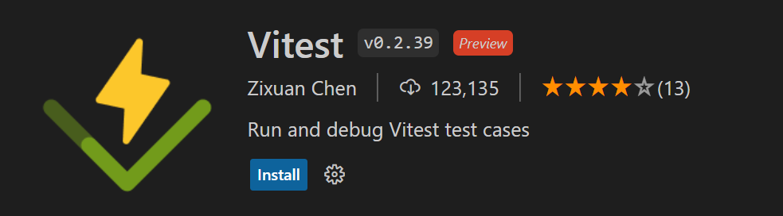
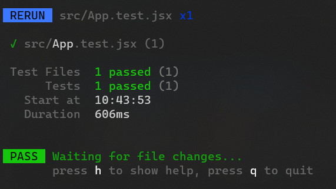
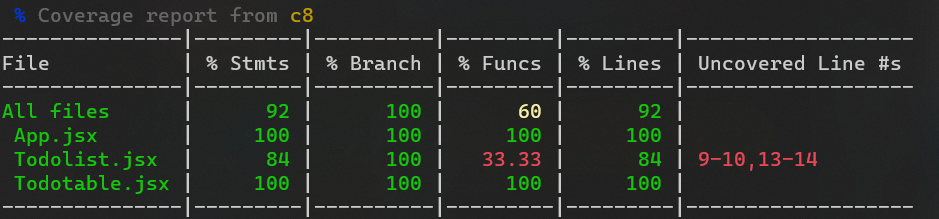

- **Vitest** (https://vitest.dev/) is a testing framework that can be used easily with vite projects.
- Vitest provides a Jest like API that is good replacement in the most cases.
- Vitest also includes the common features required when setting up unit tests (mocking, snapshots, coverage)
- Install Vitest using the following npm command. The `-D` flag is used to install development dependencies. The package is saved in the `devDependencies` section of the `package.json` file:

```bash
npm install -D vitest
```

### Configuration
- Configuration of Vitest is unified with Vite and it is made in the **vite.config.js** file's `test` property.

```js title="vite.config.js"
import { defineConfig } from "vite";
import react from "@vitejs/plugin-react";

export default defineConfig({
  plugins: [react()],
  test: {
    // vitest configuration
  },
});
```

### Running tests
- You can run vitest in the project where it is installed using the npx.
- Or we can add the follwing npm scripts in the package.json file

```json title="package.json"
{
  "scripts": {
    ...
    "test": "vitest",
    "coverage": "vitest run --coverage"
  }
}
```
- Now, you can run tests using the following command

```bash
npm run test
```
- There is also Vitest VSCode extension available that can be used to run test cases.



### Testing React components

When testing React components, we need other testing libraries
  - **React Testing Library** helps you to test React components
  - **jest-dom** library provides custom matchers that you can use to extend vitest (See all matchers https://github.com/testing-library/jest-dom)
  - **jsdom** provides Browser API

Install the libraries using the following npm command:

```bash
npm install -D jsdom @testing-library/react @testing-library/jest-dom
```

- We also have to change our vitest configuration.

```js title="vitest.config.js"
export default defineConfig({
  plugins: [react()],
  test: {
    globals: true,
    environment: "jsdom",
  },
});
```
- `globals` - Enables Jest globals API (https://jestjs.io/docs/api).
- `environment` - Defines the environment that will be used for testing (Node.js is default). We will use browser based environment **jsdom**.

- Now, we will create our first test case using the todolist that we have developed. If you follow this example, you should add 'My Todolist' header to your own App component. Our test cases renders the App component and check that there is 'My Todolist' text.
- Create a new file called **_App.test.jsx_** in the `src` folder and add the first test case.

```js title="App.test.jsx"
import App from "./App";
import { test } from "vitest";

test("renders header", () => {});
```
- Import the `render` method from the React testing library. The `render` method can be used to render React component for testing.

```js title="App.test.jsx"
import App from "./App";
import { test } from "vitest";
// highlight-next-line
import { render } from "@testing-library/react";

test("renders App component", () => {
  // renders the App component for testing
  // highlight-next-line
  render(<App />);
});
```

- Next, import the `screen` method from the React Testing Library.
- The `screen` method returns an object that provides queries (i.e. `getByText`, `getByLabelText` etc.) that are bound to the whole rendered `document.body`. These queries can be used to find elements from the HTML document.
- In the following example, we use `getByText()` query to find an element with specified text.
- The forward slash (/) in **/My Todolist/i** to define a regular expression pattern, and the i-flag at the end stands for case-insensitive. This means it is looking for rendered content that contains the “Hello World” text in a case-insensitive matter. You can also use a full string match that is case-sensitive by passing a string as an argument to `getByText()` query.

```jsx title="App.test.jsx"
import App from "./App";
import { test } from "vitest";
import { render, screen } from "@testing-library/react";

test("renders App component", () => {
  render(<App />);
  // highlight-next-line
  const header = screen.getByText(/My Todolist/i);
});
```
- Then, we check if the header text exists in DOM using the `toBeInTheDocument()` matcher from the jest-dom library. We have to import `@testing-library/jest-dom/vitest` to extend Vitest mathcers. Then, you can use jest-dom matchers with Vitest.
- The purpose of this test is to ensure that when the `App` component is rendered, it contains a header with the text "My Todolist". If the header is found, the test passes; otherwise, it will fail. 

```jsx title="App.test.jsx"
import App from "./App";
import { test, expect } from "vitest";
import { render, screen } from "@testing-library/react";
import '@testing-library/jest-dom/vitest';

test("renders App component", () => {
  render(<App />);
  const header = screen.getByText(/My Todolist/i);
  // highlight-next-line
  expect(header).toBeInTheDocument();
});
```
- Now, you can run your first test case.



- You can change the text in the header and see how failed test case is shown.

- Let’s make one example test case for our TodoList app that we created in the React Project section. We have stateless `TodoTable` component that we want to create a test case. Test case ensures that a new todo is displayed in the todo table.

```jsx title="TodoTable.jsx"
export default function TodoTable(props) {
  return (
      <table>
        <tbody>
          {props.todos.map((todo, index) => (
            <tr key={index}>
              <td>{todo.date}</td>
              <td>{todo.desc}</td>
            </tr>
          ))}
        </tbody>
      </table>
  );
}
```
- The following code show test case for the stateless `TodoTable` component. It adds one todo item to the table and check that it is displayed.
- We use `getByRole()` to find the table element and `toHaveTextContent()` for assertion.

```jsx
...
import TodoTable from './TodoTable';
import { test, expect } from "vitest";
import { render, screen } from "@testing-library/react";

...
test('renders todotable', () => {
  const row = [
    {desc: 'Go to coffee', date: '24.01.2023'}
  ];
  render(<TodoTable todos={row} />);
  const table = screen.getByRole('table');
  expect(table).toHaveTextContent((/go to coffee/i);
});
```
- You can also test for the opposite of a matcher using the `not` keyword.

```js
const table = screen.getByRole('table');
expect(table).not.toHaveTextContent((/go to coffee/i);
```
- If you assert element that is not present, it is recommended to use `queryBy*` methods instead of `getBy*`. The `getBy*` queries throws an error if no element is found.
- React testing library provides `fireEvent` method that you can use for firing DOM events, such as button click
- For example, to simulate button click:
```js
import { render, screen, fireEvent } from "@testing-library/react";

// Find button element
const button = screen.getByText("My Button");
// Fire click event
fireEvent.click(button);
```
- Let’s create a test where values are added to the description and date input elements and then the Add button is pressed. After that, a new todo item should be added to the table.
- The functionality that we want to test is now in the `App` component; therefore, we will add a new test into the **App.test.js** file

```jsx title="App.jsx"
function App() {
  const [todo, setTodo] = useState({ desc: "", date: "" });
  const [todos, setTodos] = useState([]);

  const addTodo = (event) => {
    setTodos([...todos, todo]);
    setTodo({ desc: "", date: "" });
  };

  const inputChanged = (event) => {
    setTodo({ ...todo, [event.target.name]: event.target.value });
  };

  return (
    <div className="App">
      <input
        placeholder="Date"
        name="date"
        value={todo.date}
        onChange={inputChanged}
      />
      <input
        placeholder="Description"
        name="desc"
        value={todo.desc}
        onChange={inputChanged}
      />
      <button onClick={addTodo}>Add</button>
      <TodoTable todos={todos} />
    </div>
  );
}
```
- First, we will add new test case to the **App.test.jsx** file and we render the `App` component.
```jsx title="App.test.jsx"
test("add todo", () => {
  render(<App />);
});
```

- Next, we can add value to the input elements by using the `fireEvent` method. Correct input element can be found using `getByPlaceholderText` query that jest-dom provides.

```js title="App.test.jsx"
const desc = screen.getByPlaceholderText("Description");
fireEvent.change(desc, { target: { value: "Go to coffee" } });
const date = screen.getByPlaceholderText("Date");
fireEvent.change(date, { target: { value: "29.01.2023" } });
```

- Finally, we can use `fireEvent` to click the Add button. Correct button is found using the `getByText()` query (jest-dom)

```js title="App.test.jsx"
const button = screen.getByText("Add");
fireEvent.click(button);
```
- Now, the new todo item should be added to the table and we can use the following statements to assert that.
```js title="App.test.jsx"
const table = screen.getByRole("table");
expect(table).toHaveTextContent(/go to coffee/i);
```
- Below is the whole test case code:

```jsx title="App.test.jsx"
test("add todo", () => {
  render(<App />);
  const desc = screen.getByPlaceholderText("Description");
  fireEvent.change(desc, { target: { value: "Go to coffee" } });
  const date = screen.getByPlaceholderText("Date");
  fireEvent.change(date, { target: { value: "29.01.2023" } });
  const button = screen.getByText("Add");
  fireEvent.click(button);
  const table = screen.getByRole("table");
  expect(table).toHaveTextContent(/go to coffee/i);
});
```
---
### Coverage testing

- _"In computer science, code coverage is a percentage measure of the degree to which the source code of a program is executed when a particular test suite is run"_ - Wikipedia
- You can run coverage test using the command `npm run coverage`


